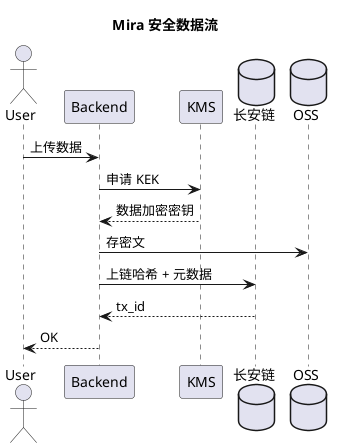

这是一篇项目复盘。Mira 是我参与约两年的隐私计算平台，基于长安链做数据要素流通。本文只讲其中一件事：**一次"上传数据"的请求，后端到底做了什么。**

## 总体流程



看起来只有 7 步。但每一步都有坑。

## 1. KEK 派生

KEK（Key Encryption Key）不是每次请求都生成一把新的。它来自一个长期的根密钥，按"租户 + 数据类别 + 时间分片"派生。好处：

- 同一个租户在同一时间片内共享一把 KEK，只做一次 KMS RPC
- 不同时间片不共享，限制单个 KEK 被破解后的影响面

派生算法用 HKDF-SHA256，info 字段格式固定为 `mira/v4/<tenant>/<category>/<yyyy-mm>`，跨版本不兼容，这点写死在代码里，没有开关。

## 2. 密文落盘

拿到 KEK 后用 AES-GCM 加密明文，算出 `ciphertext + nonce + tag`。这部分没什么特别，注意两点：

- **nonce 永不重用**：每次调用都从 CSPRNG 生成 12 字节；nonce 和 tag 一起和密文拼到对象头部
- **分块加密**：大文件按 8MB 分块，每块一个 nonce，最后把 chunk index 写到额外认证数据（AAD）里，避免攻击者重排 chunk

## 3. 上链

上链的不是密文，而是**密文哈希**加少量元数据。链上记录大体长这样：

```json
{
  "data_id": "d_xxxx",
  "sha256": "f3c2...",
  "size": 1048576,
  "owner": "tenant_a",
  "ts": 1715400000,
  "kek_ref": "mira/v4/tenant_a/health/2026-05"
}
```

- `sha256` 是密文的哈希，不是明文的。这样既能证明"某个时间点某个租户的确存过这个密文"，又不会把明文特征带上链
- `kek_ref` 只是一个引用，真正的 KEK 还在 KMS 里；链上拿不到密钥

## 4. 为什么不把明文上链

经常有人问这个。答案有三个：

1. **链上全是公开可读的**，哪怕是许可链也要假设参与方会窥探
2. **链上存储昂贵**，每个字节都要多方共识
3. **合规**：数据要素流通的核心诉求是"可用不可见"，明文一旦上链就失去了可控性

## 5. 大文件交付

前面说的是 API 上传场景。另有一条通道是"大文件交付"，比如几十 GB 的医疗影像。这条路的区别：

- 客户端直传 OSS，后端只签 STS 临时 token
- 上链的哈希由**客户端计算**并提交，后端再做一次服务端哈希校验，两者不一致就拒绝
- 这样后端不承担 GB 级流量压力，同时保留了篡改检测

## 踩过的坑

- **KMS 限流**：早期 KEK 不做缓存，每次请求都调 KMS，高峰期被限流。加上时间分片派生 + 本地 LRU（5 分钟过期）后解决
- **链交易超时**：上链是同步等待 `tx_id` 的，链拥塞时接口延迟飙升。改成"先返回 pending，链上确认后异步回调"
- **nonce 冲突**：有一次代码 bug 导致 nonce 取自 `time.Now().UnixNano()`，并发下必然冲突。AES-GCM 碰到 nonce 重用直接 KEY 泄露。这是血的教训，全面改用 `crypto/rand`

---

写得很快，细节还有很多没展开，比如 KEK 轮换、链账户管理、跨链 relay。以后有空再单独拆。
