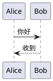

写技术文档离不开时序图、流程图。一般的做法是画完图、导出 PNG、上传、在 Markdown 里插图。这流程太重，每次改图都要走一遍。

本文这个博客（以及我另外一个 [live-preview 工具](https://jiashuwang0.github.io/live-preview/)）里都支持：**直接在 Markdown 里写 PlantUML 代码，渲染时自动变成图**。

## 效果

<pre>

</pre>

渲染出来是这样（你正在读的就是真图）：


## 原理

PlantUML 官方提供了一个公网服务 `https://www.plantuml.com/plantuml/svg/<encoded>`，只要把源代码按 PlantUML 自己的规则编码塞到 URL 里，GET 回来就是 SVG。

编码规则是两步：

1. **DEFLATE 压缩**（raw，无 zlib 包头）
2. **自定义 base64**：用 `0-9A-Za-z-_` 作为 6-bit 字母表，和标准 base64 的字母表不一样

所以在浏览器里复刻这两步就行。

## 实现

### 编码部分（约 40 行）

```js
// pako 做 DEFLATE
function plantumlEncode(text) {
  const utf8 = new TextEncoder().encode(text);
  const compressed = pako.deflateRaw(utf8, { level: 9 });
  return encode64(compressed);
}

// 自定义 6-bit base64
function encode6bit(b) {
  if (b < 10) return String.fromCharCode(48 + b);       // 0-9
  b -= 10;
  if (b < 26) return String.fromCharCode(65 + b);       // A-Z
  b -= 26;
  if (b < 26) return String.fromCharCode(97 + b);       // a-z
  b -= 26;
  if (b === 0) return '-';
  if (b === 1) return '_';
  return '?';
}

// 三字节 -> 四字符 的重组（和 base64 一样）
function append3bytes(b1, b2, b3) {
  const c1 = b1 >> 2;
  const c2 = ((b1 & 0x3) << 4) | (b2 >> 4);
  const c3 = ((b2 & 0xF) << 2) | (b3 >> 6);
  const c4 = b3 & 0x3F;
  return encode6bit(c1) + encode6bit(c2) + encode6bit(c3) + encode6bit(c4);
}
```

### Markdown 集成

用 marked 的自定义 renderer 截获 `plantuml` 代码块，输出一个占位 div，然后异步 fetch SVG 填进去：

```js
const r = new marked.Renderer();
r.code = function(code, lang) {
  if ((lang || '').toLowerCase() === 'plantuml') {
    const b64 = btoa(unescape(encodeURIComponent(code)));
    return `<div class="plantuml-block" data-code="${b64}"></div>`;
  }
  // 其他语言走 highlight.js
  return `<pre><code class="language-${lang}">${hljs.highlightAuto(code).value}</code></pre>`;
};
```

渲染完后：

```js
async function hydrate(root) {
  const blocks = root.querySelectorAll('.plantuml-block[data-code]');
  await Promise.allSettled([...blocks].map(async el => {
    const code = decodeURIComponent(escape(atob(el.dataset.code)));
    const url = `https://www.plantuml.com/plantuml/svg/${plantumlEncode(code)}`;
    const resp = await fetch(url);
    el.innerHTML = await resp.text();
  }));
}
```

## 踩过的坑

**1. 串行 await 会拖死状态条**

最初我写 `for ... of blocks { await fetch(...) }`，一张图挂了后面全 pending，状态栏永远"渲染中"。改成 `Promise.allSettled(blocks.map(...))` 并发跑，并加上 `AbortController` 超时。

**2. marked 升级破坏 API**

marked v5+ 把 `r.code(code, lang)` 的参数改成了一个 token 对象。如果 CDN 不锁版本，某天突然渲染就全挂。两个保险：

- CDN 路径锁版本 `marked@4.3.0`
- renderer 里做参数兼容：`if (typeof code === 'object') { lang = code.lang; code = code.text; }`

**3. DOMPurify 吃掉自定义属性**

默认配置下 `data-code` 和 `id` 都会被剥掉。用 `DOMPurify.sanitize(html, { ADD_ATTR: ['data-code', 'id'] })` 放行。

## 离线方案

如果要完全脱离 plantuml.com：

- 本地跑 [plantuml.jar](https://plantuml.com/download)：`java -jar plantuml.jar -tsvg < in.puml > out.svg`
- 或者用 [kroki.io](https://kroki.io) 的自部署镜像，支持 PlantUML / Graphviz / Mermaid 等等

把前端 fetch 的 URL 换掉即可，编码逻辑 100% 复用。

---

就这样。任何一个静态页面都能拥有"写代码就出图"的能力，十几行 JS 的事。
