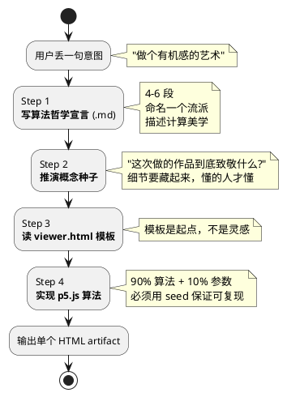
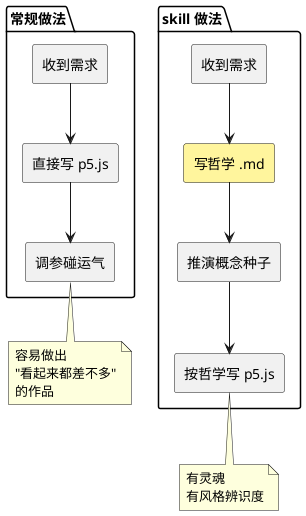
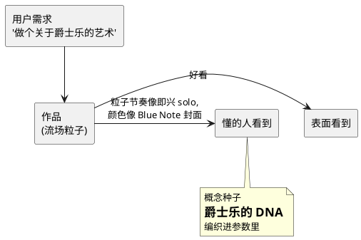
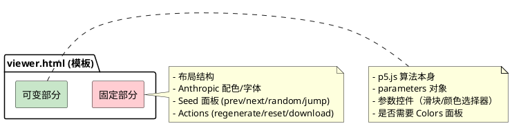
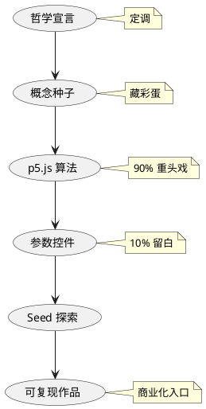

> 拆解 Anthropic 官方 algorithmic-art skill：为什么做生成艺术的第一步不是写代码，而是写"哲学宣言"。

## 一句话定义

algorithmic-art 是一套让 AI 做生成艺术的工作流，核心反直觉——**代码在最后写，先写一份算法哲学宣言**。

## 总览图



## 生活类比

这和**一位前辈画家先写画派宣言，再教徒弟画画**是同一个套路：

| 步骤                  | 传统艺术             | algorithmic-art      |
|---------------------|------------------|----------------------|
| 老师先写宣言            | "印象派要捕捉瞬间光影"   | "Organic Turbulence: 混沌受限于自然律" |
| 宣言定调               | 不能用黑色勾边、不画细节     | 一定要用 Perlin 噪声、粒子轨迹  |
| 徒弟照宣言创作           | 每张画不一样但都有印象派气质   | 每个 seed 生成不同画，但风格一致 |

**先哲学，再代码**——这是这个 skill 和普通生成艺术教程最大的区别。

## 核心拆解

### 1. 为什么要写哲学宣言？



不写哲学的后果：AI 会选一个流行模板（比如流场），调调参数，输出一张"长得像生成艺术"的图。写了哲学后：AI 被迫思考"这次的美在哪里"，再由美学反推算法选择。

### 2. 四类常见哲学模板

skill 给了五个范式，这里挑三个最典型的：

| 流派                  | 一句话哲学                | 算法对应            |
|---------------------|---------------------|-----------------|
| Organic Turbulence  | 混沌受限于自然律            | Perlin 噪声 + 粒子流场 |
| Quantum Harmonics   | 离散个体呈现波动干涉图样       | 网格粒子 + 相位干涉    |
| Recursive Whispers  | 有限空间里的无限自相似        | L-system + 黄金比递归 |
| Field Dynamics      | 让隐形的力通过物质痕迹显形    | 向量场 + 粒子轨迹遗留   |
| Stochastic Crystallization | 随机过程结晶为有序结构 | Voronoi + 松弛算法 |

**这张表的价值**在于：它把"哲学"和"算法"做了双向映射。有哲学没算法 = 空谈；有算法没哲学 = 套模板。

### 3. 哲学必须反复强调"大师手笔"

skill 里有一条很特别的要求：

> The philosophy MUST stress multiple times that the final algorithm should appear as though it took countless hours to develop...
> repeat phrases like "meticulously crafted algorithm," "painstaking optimization," "master-level implementation."

为什么要**反复**说？因为 LLM 在没被暗示的时候，会默认写出"差不多就行"的代码。明确提示"这是大师级工艺"后，它会：

- 用更讲究的调色盘（不默认 RGB）
- 加更多参数微调（不甩一个固定值）
- 写更讲究的粒子行为（不用最朴素的布朗运动）

**用 prompt 给 AI 植入审美自信心，是这个 skill 最有意思的技巧。**

### 4. 概念种子：藏在代码里的小彩蛋



skill 把这叫做"像爵士音乐家在独奏里引用另一首曲子"——懂的人会心一笑，不懂的也觉得好听。这种**隐藏层**让作品有"二次阅读"价值。

### 5. 为什么必须用 seed

```javascript
let seed = 12345;
randomSeed(seed);
noiseSeed(seed);
```

三个动机：

1. **可复现**：同一个 seed = 同一幅画，方便分享和迭代
2. **可探索**：prev/next/random 按钮让用户浏览"宇宙切片"
3. **可商品化**：Art Blocks 模式下，每个 seed = 一件独立 NFT

**这是从生成艺术商业实践直接借鉴来的工程规范，不是拍脑袋想的。**

### 6. 模板的刚性约束



skill 原文：

> The **template is the STARTING POINT**, not inspiration.

这条规则的作用是**把 UI 一致性和艺术自由度分开**——UI 锁死保证用户体验统一，艺术部分完全放飞保证作品差异。两个目标原本冲突，用这条规则解决掉了。

## 对比：写 vs 不写哲学

| 维度        | 不写哲学          | 写哲学          |
|-----------|---------------|-------------|
| 启动速度       | 快（直接上代码）     | 慢（要先想 10 分钟） |
| 风格辨识度      | 低（像网上教程）     | 高（有宣言做锚点）   |
| 参数选择依据     | "差不多"         | "哲学要求这样"     |
| 跨作品一致性     | 只靠调色盘        | 有哲学的连续性     |
| 调优时的判断标准   | "好看不好看"      | "符不符合宣言"   |

## 常见坑

- **上来就写代码**：跳过哲学这步，成品会"没魂"
- **哲学只写一次"大师级"**：LLM 会忽略，要重复 3-5 次才生效
- **不用 seed**：刷新一下作品就变了，没法沉淀
- **重写模板**：失去 UI 一致性，每件作品像在不同网站上
- **参数全给固定值**：失去"探索感"，用户点了跟没点一样
- **颜色随便 random(255)**：不协调，暴露"AI 味"；要用预设调色盘

## 一张图收尾



algorithmic-art 最值得学的不是 p5.js，是那个反直觉的顺序：**先写哲学，再谈工程**。AI 和人一样，有方向才有手感。
