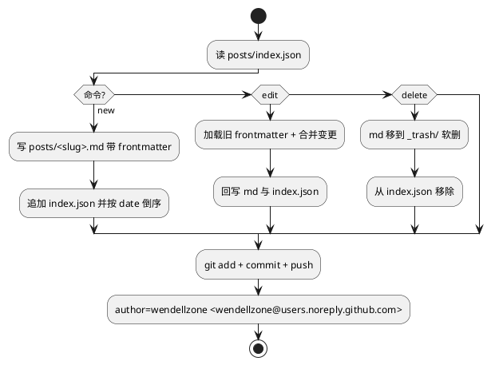

在本地装了一个 WorkBuddy skill `blog-post`，把"发博客 / 改博客 / 删博客"的流程封装成脚本。下次直接说"写篇博客讲 xxx"，AI 就会走完本地 markdown、frontmatter、`posts/index.json`、`git commit --author`、`git push` 这一串操作，我只看结果。

## 为什么要 skill 化

之前每次发文都是手动：

1. 起个 slug
2. 写 markdown + 在开头手敲 frontmatter
3. 打开 `posts/index.json`，在数组里追一条（**经常忘，然后列表页刷不出来**）
4. 切回 iTerm，`git commit`，`git push`
5. 等 30 秒再开浏览器验证

第 3 步是最容易漏的，第 4 步的 commit author 要手动覆盖（全局 git 是工作邮箱），第 5 步如果 `.md` 返回 404 还要想起来是不是 Jekyll 作祟。

## skill 做了什么

核心是一个 `publish.py`，零依赖：

```
publish.py new    --title "..." --tags "a,b" --summary "..." --body-file /tmp/x.md
publish.py edit   <slug> [--title ...] [--body-file ...]
publish.py delete <slug>
publish.py list
```

脚本内部：



几个小细节：

- `delete` 是**软删**：`.md` 先挪到 `_trash/<slug>-<timestamp>.md`，万一说错了 slug，`git mv` 回来就行
- 推送失败先 `git pull --rebase` 再推一次，避免和远端冲突
- 纯中文标题 slug 自动兜底 `post-<时间戳>`，但会建议显式传 `--slug`
- 可选 `--no-push` 做 dry-run

## 每次改动都在 git 里吗

是。每一次 `new / edit / delete` 都是一次独立 commit，消息是 `post: add 'xxx'` / `post: update 'xxx'` / `post: remove 'xxx'`。想看历史：

```bash
git log --oneline posts/
git show <commit>
```

想恢复被删的文章，直接 `git checkout <commit> -- posts/<slug>.md`，再把 index 补回去；或者在 `_trash/` 里翻。

## 怎么用

下次想发博客，直接跟 WorkBuddy 说"帮我写一篇关于 X 的博客"或者"把那篇 Mira 的博客 summary 改一下"就行。triggers 都写进 skill 的 description 了，AI 会自动激活。
