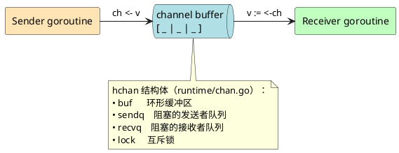
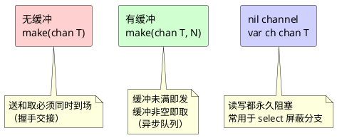
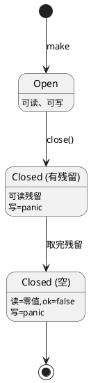
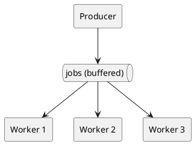
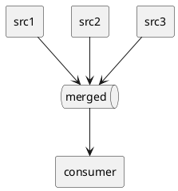
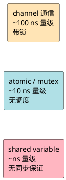

> 一句话：channel 是 goroutine 之间传递数据的「带锁队列 + 调度通知」。

不是消息队列，不是 socket，不是共享变量。是 Go 内置的、被 runtime 深度集成的同步管道。

## 1. 一张图看懂



发送方把数据塞进缓冲区，接收方取走。缓冲满了发送方睡觉，缓冲空了接收方睡觉，runtime 负责把睡着的 goroutine 唤醒。

## 2. 生活类比：菜市场的传菜窗口

| 现实 | Channel |
|------|---------|
| 厨师把菜放上窗口 | `ch <- v` |
| 服务员从窗口取菜 | `v := <-ch` |
| 窗口能放几盘菜 | `make(chan T, N)` 的 N |
| 窗口满了，厨师手举着等 | 发送阻塞 |
| 窗口空了，服务员站着等 | 接收阻塞 |
| 餐厅打烊 | `close(ch)` |
| 关门后还没取走的菜可以取 | 关闭后仍可读残留数据 |
| 关门后再放菜 | panic |

记住这个画面，下面所有规则都自然推导得出。

## 3. 三种形态



### 无缓冲 vs 有缓冲：握手 vs 队列

```go
// 无缓冲：必须同步
ch := make(chan int)
go func() { ch <- 1 }()  // 阻塞，直到有人接
fmt.Println(<-ch)        // 接到 1

// 有缓冲：先入队
ch := make(chan int, 2)
ch <- 1   // 不阻塞
ch <- 2   // 不阻塞
ch <- 3   // 阻塞！缓冲满了
```

## 4. 操作矩阵（必须背下来）

| 操作 | nil | 空且未关 | 满且未关 | 已关 |
|------|-----|---------|---------|------|
| `ch <- v` 发送 | 永久阻塞 | 阻塞或入队 | 阻塞 | **panic** |
| `v := <-ch` 接收 | 永久阻塞 | 阻塞 | 取出 | 取残留 / 取零值 |
| `close(ch)` | **panic** | 正常 | 正常 | **panic** |

三个 panic 是初学者最常踩的坑。一句话规则：**只有发送方有资格 close，且只能 close 一次。**

## 5. 关闭的语义



判断是否已关：

```go
v, ok := <-ch
if !ok {
    // channel 已关且无残留
}

// range 自动在关闭后退出
for v := range ch {
    fmt.Println(v)
}
```

## 6. select：channel 的 switch

```plantuml
@startuml
skinparam backgroundColor transparent

(*) --> "select" as S
S --> "case <-chA" : A 就绪
S --> "case chB <- v" : B 可写
S --> "case <-time.After(1s)" : 超时
S --> "default" : 都没就绪
@enduml
```

```go
select {
case v := <-jobs:
    handle(v)
case <-ctx.Done():
    return                       // 取消信号
case <-time.After(3 * time.Second):
    return errors.New("timeout") // 超时控制
}
```

**关键性质**：多个 case 同时就绪时，runtime **随机**选一个。不是顺序，不能依赖。

## 7. 三种最常见的用法

### 7.1 任务分发（worker pool）



```go
jobs := make(chan int, 100)
for w := 0; w < 3; w++ {
    go func() {
        for j := range jobs {
            process(j)
        }
    }()
}
for i := 0; i < 1000; i++ { jobs <- i }
close(jobs) // worker 自动退出
```

### 7.2 信号通知（done channel）

```go
done := make(chan struct{})
go func() {
    doWork()
    close(done) // 关闭即通知
}()
<-done
```

`chan struct{}` 不占内存，专门当信号用。

### 7.3 扇入/扇出



多个生产者 → 一个 channel → 单消费者，天然合并多路数据流。

## 8. 五个常踩的坑

| 坑 | 后果 | 解法 |
|---|------|------|
| 向已关闭 channel 写 | panic | 由发送方负责 close |
| 重复 close | panic | `sync.Once` 保护 close |
| 接收方 close | panic 风险 | 永远不要在接收方 close |
| 忘记 close 导致 range 不退出 | goroutine 泄漏 | 数据发完立即 close |
| 缓冲过大当队列用 | 内存爆炸、丢失反压 | 缓冲是同步窗口不是队列 |

## 9. 性能直觉



channel 的成本不在数据拷贝，而在 **锁 + goroutine 调度切换**。高频热路径用 atomic，低频协调用 channel。

> Go 的口号：**Don't communicate by sharing memory; share memory by communicating.**
> 翻译：能用 channel 把状态传过去，就别用全局变量加锁。

## 10. 心智模型一句话总结

> Channel = 一段缓冲区 + 两条等待队列 + 一把锁 + runtime 调度器。
> 把它当「会通知人的队列」用，不要当「内存共享」用。

读到这里就够了。剩下的细节（`hchan` 源码、`sudog` 结构、`gopark/goready` 调度）等需要时再看 `runtime/chan.go`，不到 800 行。
