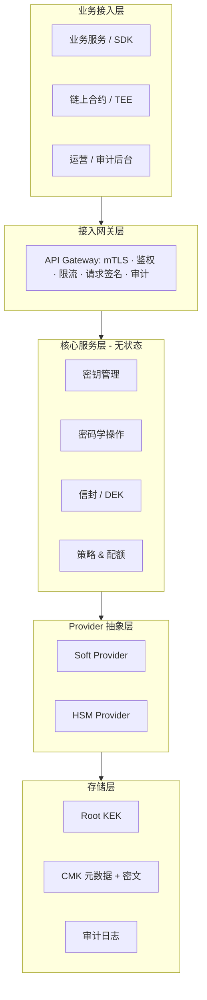
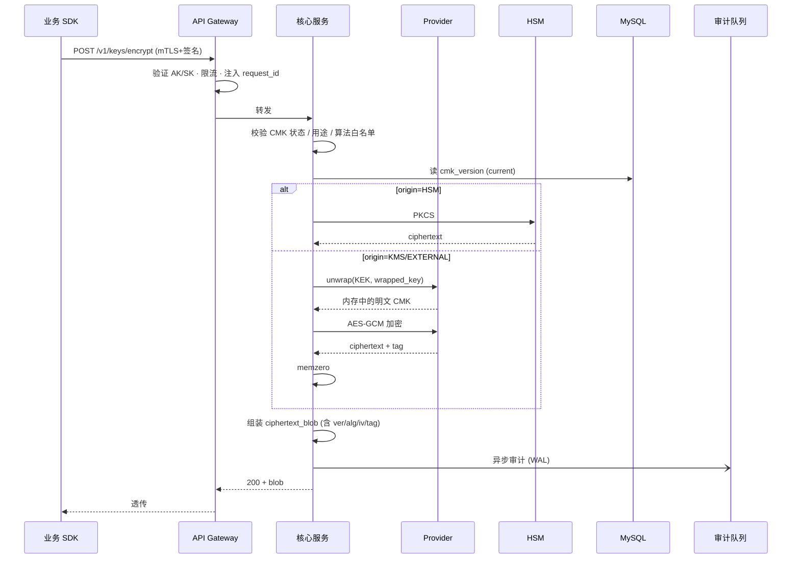

写一个"密钥服务"，难的从来不是 AES 怎么调，而是这堆问题怎么同时拿下：算法可换、密钥不出域、调用方不感知细节、合规审计不可抵赖、HSM 和软实现一套接口、轮换不掉数据、内鬼不能单点作恶。这篇先把整体分层和算法选型说清楚，CMK 生命周期与审计放下一篇。

## 一、它到底在做什么

抽象到最朴素，密钥服务（KMS）就四件事：

1. **密钥生命周期管理**：生成 / 导入 / 轮换 / 启停 / 销毁
2. **密码学操作**：加解密、签名验签、HMAC、KDF、密钥协商
3. **信封加密**：DEK 由 KEK 包裹，业务侧只持密文 DEK
4. **审计与合规**：所有调用留痕，敏感操作多重授权

把这四件事抽出去做成中台，业务才不用每个团队都自己掉一次密钥泄漏的坑。

## 二、分层架构

从上往下五层，每一层职责单一，越往下越接近"硬件 / 不可变"。



几条边界要守住：

- **网关层只做"准入"**，不碰任何密码学逻辑。鉴权失败、限流被打断的请求绝不进核心服务。
- **核心服务层无状态**。所有可变状态在 MySQL 和 HSM，扩容直接加副本。
- **Provider 是抽象**。业务侧的 `Encrypt(keyID, ...)` 不知道也不应该知道这把 key 在 HSM 里还是在内存里。
- **存储层只读密文**。Root KEK 永远不落 MySQL，否则脱库即破产。

## 三、三层信封：Root KEK → CMK → DEK

KMS 的密钥分三层，每层只解开下一层：

```
Root KEK（HSM 内或 Shamir 分片，永不导出）
   └── 包裹 → CMK（租户主密钥，密文存 MySQL）
              └── 包裹 → DEK（数据加密密钥，业务侧持密文）
```

为什么要三层：

- **Root KEK 不能频繁碰**。它一旦换，所有 CMK 都要重包，风险太大。
- **CMK 是策略单位**。每租户/每业务一把，授权、轮换、审计都按它走。
- **DEK 是性能单位**。业务真正用来加大块数据的就是它，本地加解密，零网络往返。

业务推荐姿势：

1. 调一次 `GenerateDataKey`，拿到 `(明文 DEK, 密文 DEK)`
2. 用明文 DEK 在本地加密大数据，明文 DEK 用完立即清零
3. 把"密文 DEK + 数据密文"一起落库
4. 解密时调 `Decrypt(密文 DEK)` 还原明文 DEK，再本地解大数据

只有那种小到 4KB 以内的配置项、token，才直接走 `Encrypt(keyID, plaintext)`。

## 四、算法选型矩阵

按"国际 + 国密"双栈，运行时由 `algorithm` 字段路由。

| 用途 | 国际算法 | 国密对等 | 备注 |
|---|---|---|---|
| 对称加解密 | AES-256-GCM / AES-256-CBC+HMAC | SM4-GCM / SM4-CBC | 默认 GCM，IV 12B、Tag 16B |
| 非对称加解密 | RSA-OAEP-2048/3072 (SHA-256) | SM2 | RSA-PKCS1v1.5 仅向后兼容 |
| 数字签名 | ECDSA-P256 / Ed25519 / RSA-PSS | SM2 | 默认 Ed25519，链上场景 secp256k1 |
| 密钥协商 | ECDH-P256 / X25519 | SM2-KE | 协商出 share 后走 HKDF |
| HMAC / KDF | HMAC-SHA256 / HKDF-SHA256 | HMAC-SM3 / KDF-SM3 | KDF 默认 HKDF |
| 摘要 | SHA-256 / SHA-3 | SM3 | |
| 随机数 | DRBG（HSM 优先） | GM/T 0105 DRBG | 强制 HSM 起动注入种子 |
| 密钥包裹 | AES-KW / AES-GCM-KW | SM4-KW | KEK → DEK |

几条强约束，别图省事破规：

- **ECB 全场景禁用**。
- **CBC 必须配 HMAC**（Encrypt-then-MAC），否则 padding oracle 等着你。
- **IV / Nonce 由服务端生成**，调用方不可指定，避免 nonce 复用。
- **解密时不接受调用方传 algorithm**。算法从密文 blob 头里读出来强制使用，否则可能被降级攻击。
- **AES-GCM 同 key 下 nonce 用尽要换 key**（2^32 量级调用就该轮换）。

## 五、密文 blob 自描述格式

`Encrypt` 返回的密文不能是裸 ciphertext，否则解密时不知道用哪把 key、哪个版本、哪种算法。设计成自描述结构：

```
[magic(2) | ver(1) | alg(2) | key_id_len(1) | key_id | key_version(4) | iv(12) | tag(16) | ct(n)]
```

- `magic` 标识"这是 KMS 密文"，方便排查
- `ver` 是 blob 格式版本，将来扩展
- `alg` / `key_version` 解决轮换后历史密文的解密问题
- `iv` / `tag` 是 AES-GCM 自带的

`Decrypt` 接口因此只需要一个 `ciphertext_blob` 参数——所有路由信息都在 blob 里，调用方只管 round-trip 不需要记任何元数据。

## 六、Provider 抽象：软实现与 HSM 同接口

Go 的接口定义大概长这样（伪代码）：

```go
type Provider interface {
    GenerateKey(spec KeySpec) (KeyHandle, error)
    Encrypt(h KeyHandle, plaintext, aad []byte, alg Algo) ([]byte, error)
    Decrypt(h KeyHandle, ciphertext, aad []byte, alg Algo) ([]byte, error)
    Sign(h KeyHandle, msg []byte, alg Algo) ([]byte, error)
    Verify(h KeyHandle, msg, sig []byte, alg Algo) (bool, error)
    Wrap(kek, dek KeyHandle) ([]byte, error)
    Unwrap(kek KeyHandle, wrapped []byte) (KeyHandle, error)
}
```

两套实现：

- **Soft Provider**：基于 OpenSSL / BoringSSL / Tongsuo（国密），密钥以"被 Root KEK 包裹的密文"形式存 MySQL，运算时在内存里 unwrap。开发、压测、不需要密评的环境用。
- **HSM Provider**：通过 PKCS#11 或 KMIP 走 HSM，密钥永不出卡。所有真实生产环境、需要满足密评/等保的环境必须用。

`KeyHandle` 是抽象——Soft 下是 unwrapped 后的内存指针 + 元数据，HSM 下是 PKCS#11 的 object handle。业务侧拿到的永远只是个 `key_id` 字符串，看不到底下是什么。

## 七、接口契约（HTTP+JSON / gRPC 双协议）

通用约定先列死：

- 路径 `POST /v1/keys/{action}`，所有写操作必须带 `Idempotency-Key`
- Header `X-Auth-AK` + `X-Auth-Sign`（HMAC-SHA256，签 method+path+body+timestamp+nonce）
- 时间戳 ±5 分钟容差，nonce 走一次性表
- 二进制字段一律 Base64
- 错误码 `{code, message, request_id, details}`，主错码 + 子错码（`KEY_DISABLED` / `ALG_MISMATCH` / `SIG_INVALID` ...）

### 7.1 Encrypt / Decrypt

```json
// POST /v1/keys/encrypt - Request
{
  "key_id": "key-7f3a1b2c",
  "plaintext": "BASE64...",
  "algorithm": "AES_256_GCM",
  "aad": "BASE64..."
}
// Response
{
  "key_id": "key-7f3a1b2c",
  "key_version": 3,
  "ciphertext_blob": "BASE64...",
  "algorithm": "AES_256_GCM"
}
```

`Decrypt` 只需 `ciphertext_blob` 和可选 `aad`。

### 7.2 GenerateDataKey

```json
// Request
{ "key_id": "key-7f3a1b2c", "key_spec": "AES_256", "aad": "..." }
// Response
{
  "plaintext": "BASE64(32B)",
  "ciphertext_blob": "BASE64...",
  "key_id": "key-7f3a1b2c",
  "key_version": 3
}
```

调用方拿到 `plaintext` 后必须 `defer memzero`，绝对不能落库不能进日志。

### 7.3 Sign / Verify

```json
// POST /v1/keys/sign - Request
{
  "key_id": "key-sig-...",
  "message": "BASE64...",
  "message_type": "RAW",
  "algorithm": "ECDSA_SHA_256"
}
// Response
{ "signature": "BASE64...", "key_id": "...", "key_version": 2 }
```

`Verify` 返回 `{ "valid": true|false }`，不区分"签名错"和"算法错"对外暴露的错误码——防侧信道。

### 7.4 管理类接口（形态一致）

`create / describe / list / enable / disable / schedule_deletion / cancel_deletion / rotate / import_material / re_encrypt`，参数形态都是 `key_id` + 操作语义，返回 CMK 元数据。

## 八、一次 Encrypt 的全链路



几个细节：

- **审计是异步但 fail-close**。WAL 写入失败要把主链路也失败掉，宁可拒绝服务也不能漏审计。
- **明文密钥的生命期**严格在 unwrap 到 memzero 之间，绝不进任何日志、绝不跨函数返回。
- **缓存策略**：unwrapped CMK 在进程内 LRU + 60s TTL + `mlock`，频繁调用不会每次都查 MySQL，但 disable / rotate 后立即失效。

## 九、可靠性、可观测、容量

落地要拍板的几件事：

- **多活**：核心服务无状态，多 AZ；MySQL 主从 + 半同步；HSM 集群至少 2 台热备。
- **限流**：默认每个 CMK 5K QPS，超限 429 + Retry-After。
- **指标**：`kms_request_total{action,result}`、`kms_latency_seconds_bucket`、`kms_hsm_session_active`、`kms_audit_lag_seconds` —— 审计延迟超阈值要立刻告警，因为审计断 = 合规破。
- **告警红线**：解密失败率 > 1%、HSM 会话异常、审计哈希链断裂、自动轮换超期。

## 十、SDK 形态

业务侧理想接口就这么几个：

```go
type Client interface {
    GenerateDataKey(ctx, keyID, spec) (plaintext, ciphertext []byte, err)
    Decrypt(ctx, ciphertext) (plaintext []byte, err)

    Encrypt(ctx, keyID, plaintext, aad) (blob []byte, err)

    Sign(ctx, keyID, msg, alg) (sig []byte, err)
    Verify(ctx, keyID, msg, sig, alg) (bool, err)
}
```

SDK 内部统一处理：mTLS 证书加载、请求签名、指数退避重试（同 `Idempotency-Key` 复用）、连接池、`defer memzero`。让上层用着像在调一个普通 RPC。

---

到这里架构主线和算法骨架已经搭起来了。下一篇接着聊：CMK 的生命周期状态机怎么画、版本和轮换怎么配合、审计日志的哈希链 + 上链锚定、以及"安全审计员"这个角色到底干什么——为什么三权分立比双人复核更重要。
