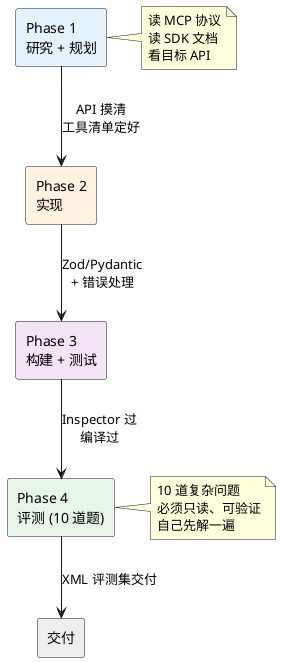
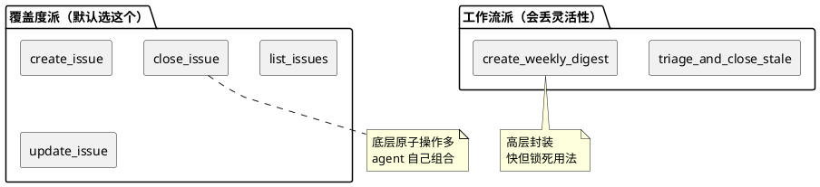
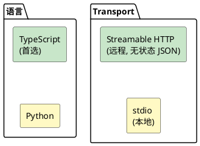

> 拆解 Anthropic 官方 mcp-builder skill：为什么造 MCP server 要分四个阶段、为什么 TypeScript 被钦点为首选。

## 一句话定义

mcp-builder 是一套「帮 AI 自己造 MCP server」的脚手架，核心是 **四阶段流水线**：研究 → 实现 → 测试 → 评测。

## 总览图



## 生活类比

把 MCP server 想成 **餐厅给外卖平台接的 API**：

| 餐厅场景               | MCP 对应          |
|--------------------|-----------------|
| 菜单要写清楚每道菜含什么       | tool description + 参数 schema |
| 点单页要有筛选、分页          | filter + pagination          |
| 下单失败要说清楚"为啥失败、能怎么办"| actionable error messages    |
| 开张前老板自己下 10 单试试     | Phase 4 评测                    |

MCP server 做得好不好，看的不是接口数量，是**外卖骑手能不能不打电话给餐厅就把单子跑完**。

## 核心拆解

### 1. 覆盖度 vs 工作流：作者的明确取向

> "When uncertain, prioritize comprehensive API coverage."

两种设计思路的对立：



作者的判断：不确定时优先做"基础工具全集"。因为 **LLM 会组合原子能力**，但原子能力如果漏了，它就组合不出来。工作流工具只在频繁重复时补充。

### 2. 命名要有前缀，不能犯懒

```
✅ github_create_issue / github_list_repos
❌ create / list
```

原因是 **AI 在工具列表里选工具时靠名字**。前缀 = 命名空间，帮 agent 一眼看出"这是 GitHub 的家伙"。没前缀的 `create` 在 20 个工具里会迷路。

### 3. 错误信息要"可执行"

对比：

| 烂错误                     | 好错误                                         |
|-------------------------|---------------------------------------------|
| `Error: invalid input`  | `Field "repo" is required. Example: {"repo": "owner/name"}` |
| `401 Unauthorized`      | `Token expired. Run: gh auth refresh`       |
| `Rate limit`            | `Rate limit hit. Retry after 42s, or use pagination with limit=10` |

好错误的特征：**告诉 agent 下一步该做什么**，而不只是"有事发生了"。

### 4. 技术栈的钦点：TypeScript first

skill 直接给出推荐：



**为什么 TypeScript 优先？** 作者列了三条理由：

1. SDK 质量更高
2. MCPB 等执行环境对 TS 更友好
3. LLM 生成 TS 的能力更强（静态类型 + lint 能让错误提前暴露）

**为什么 Streamable HTTP + 无状态 JSON？** 因为有状态会话一到规模化部署就是噩梦——扩容、重启、session 亲和性，每一个都是坑。

### 5. Phase 4 评测：10 道题是硬门槛

skill 要求必须出 10 道题，每道题有六个约束：

| 属性           | 含义                       |
|--------------|--------------------------|
| Independent  | 题之间不能互相依赖                |
| Read-only    | 不能要求写/删/改，跑起来不留污染       |
| Complex      | 要多次调用 tool，否则测不出组合能力     |
| Realistic    | 真实场景，不是刷题                |
| Verifiable   | 答案能用字符串对比判定              |
| Stable       | 答案不随时间变（别用「昨天」「最新」之类相对概念） |

举例：

```xml
<qa_pair>
  <question>
    Find discussions about AI model launches with animal codenames.
    One model needed a specific safety designation that uses the format ASL-X.
    What number X was being determined for the model named after a spotted wild cat?
  </question>
  <answer>3</answer>
</qa_pair>
```

这题漂亮在哪？

- 多步：要先检索讨论 → 找 animal codename → 匹配 "spotted wild cat" = leopard → 查 leopard 的 ASL 数字
- 可验证：答案就是 `3`，一个字符都不能错
- 稳定：leopard 的 ASL 数字不会随时间变
- 不泄题：你得真的用工具去搜，猜不到

## 四阶段检查表

| Phase | 输出物                  | 检验方式                     |
|-------|---------------------|--------------------------|
| 1     | 工具清单 + 技术栈决策         | 文档里能说清楚"为什么这些工具，为什么这个栈" |
| 2     | server 代码 + schema  | 单元编译通过                  |
| 3     | 构建产物                | MCP Inspector 能联上、能调      |
| 4     | eval.xml (10 道题)     | 另一个 Claude 能靠这个 server 答对 |

少一阶段就不叫"交付"，只叫"写了点代码"。

## 常见坑

- **工具名没前缀**：agent 在 30 个工具里选错目标
- **schema 没 description**：Claude 猜不出这个字段该填啥
- **错误信息太泛**：`Error: failed` 等于没说，浪费一轮调用
- **有状态会话**：Streamable HTTP 下容错/扩容全废
- **评测题能一步到位**：测不出 server 的组合能力
- **评测答案不稳定**：昨天跑对今天跑错，回归测试失效

## 一句话收尾

mcp-builder 的核心洞见：**写 MCP server 本质是写"给 AI 用的 API 文档"，可读性、可组合性、可评测性这三件事比代码本身重要。**
