## 写在前面

opencode 是一个开源 AI coding agent。你可以把它当作终端里的编程助手、桌面应用、IDE 扩展，也可以通过 server 和 SDK 把它接进自己的工具链。

但如果目标是学习 Agent 开发，不能只把 opencode 理解成“一个会写代码的聊天框”。更准确的说法是：**opencode 是一个围绕 LLM 构建的编程运行时**。LLM 负责推理和决策，runtime 负责上下文、工具、权限、会话、事件、持久化、压缩和恢复。

这篇文章面向已经会写后端、CLI、平台工具或 IDE 插件，但对 Agent 原理接触不多的技术人员。读完之后，你应该能回答三个问题：

- 一个 coding agent 的主循环到底是什么？
- opencode 的 core runtime 解决了哪些工程问题？
- 如果想找 Agent 开发工作，应该重点补哪些能力？

本文基于 2026-07-05 克隆的 [sst/opencode](https://github.com/sst/opencode) `dev` 分支源码，参考提交 `efd5f0a`。

## 一、先别急着看模型，先看 Agent Loop

普通聊天机器人的结构很简单：

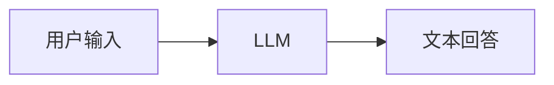

coding agent 多了一层关键东西：**行动循环**。

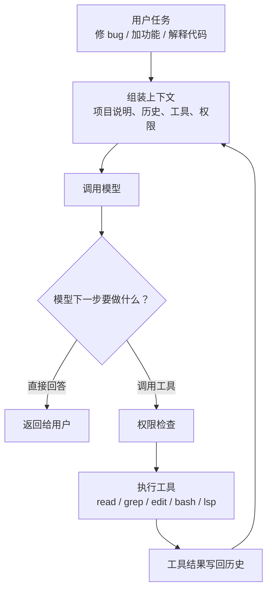

这个循环里，模型不是直接读文件、改代码、跑命令。模型只输出“我想调用什么工具，以及参数是什么”。真正执行动作的是 runtime。

所以 Agent 开发的核心不是“调一个模型 API”，而是设计一套受控的循环：

| 环节 | 关键问题 |
|---|---|
| 上下文 | 模型应该看见哪些系统提示、项目说明、历史消息和工具定义？ |
| 决策 | 模型什么时候回答，什么时候调用工具？ |
| 工具 | 工具如何定义 schema、执行、报错、截断输出？ |
| 权限 | 哪些命令可以自动执行，哪些必须问用户，哪些直接禁止？ |
| 状态 | 工具调用、用户中断、模型错误、上下文压缩怎么持久化？ |
| 继续 | 工具结果回来之后，如何进入下一轮模型请求？ |

opencode 的 core runtime 就是在解决这些问题。

## 二、opencode 的整体架构

先看全局图。

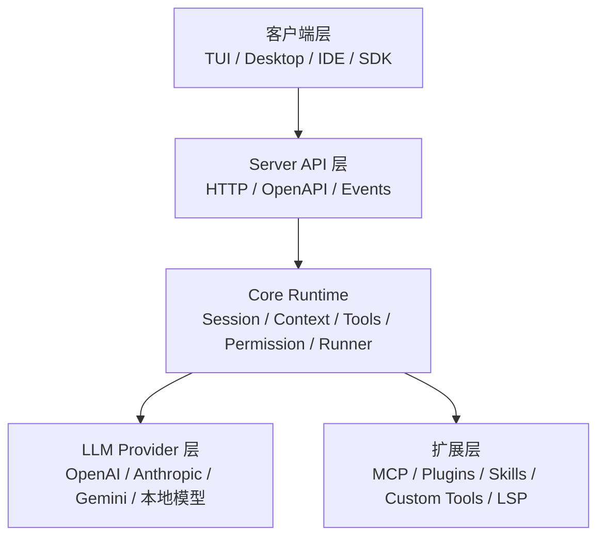

最上面是客户端。用户可能在终端里用 TUI，也可能在桌面 app 或 IDE 里用。

中间是 server。opencode 把核心能力放在 server 后面，客户端通过 API 和事件流拿状态。这也是为什么同一套 runtime 可以服务多个 UI。

核心是 `packages/core/src/`。这里是本文重点：session 怎么跑、prompt 怎么进历史、工具怎么注册、权限怎么判断、模型怎么调用、工具结果怎么写回、上下文太长怎么压缩。

LLM provider 层负责屏蔽不同模型厂商差异。opencode 当前仓库里有独立的 `packages/llm/`，core runtime 通过统一的 `@opencode-ai/llm` 接口发请求和收事件。

扩展层让 agent 不只会内置工具。MCP、插件、自定义工具、skills、LSP 都是把外部能力接进 runtime 的方式。

## 三、Core Runtime 是什么？

可以把 core runtime 想成 Agent 的“小型操作系统”：

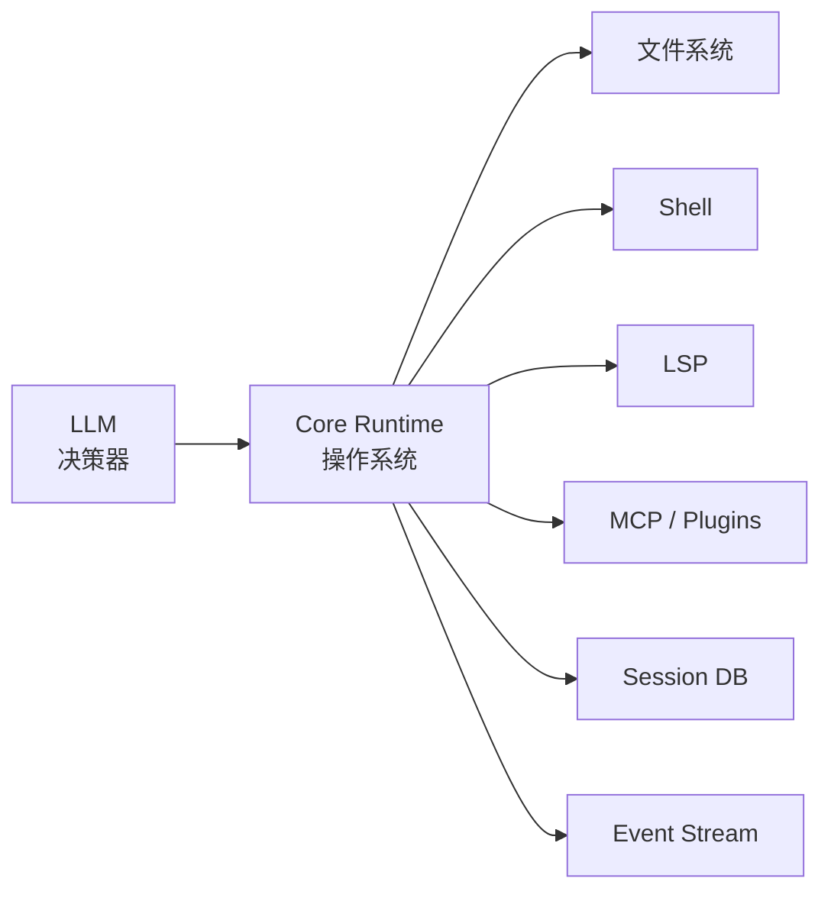

在这个类比里：

| 操作系统概念 | opencode 对应 |
|---|---|
| 进程调度 | `SessionRunner` 推动一轮轮 provider turn |
| 系统调用 | `ToolRegistry` 管理工具定义和执行 |
| 权限控制 | `PermissionV2` 判断 allow / ask / deny |
| 文件系统日志 | `SessionHistory`、`SessionStore`、事件投影 |
| 标准输出 | `EventV2` 把状态发布给 UI |
| 内存管理 | `SystemContext` 和 `SessionCompaction` 管上下文窗口 |

这也是学习 opencode 最有价值的地方。很多 Agent demo 只写了“模型返回 tool call，我就执行工具”。opencode 则把这个过程做成了可以恢复、可以审计、可以扩展、可以被多个客户端观察的 runtime。

下面进入 core runtime 的主线。

## 四、SessionRunner：一次任务如何跑起来

核心入口在 [`packages/core/src/session/runner/llm.ts`](https://github.com/sst/opencode/blob/dev/packages/core/src/session/runner/llm.ts)。

从源码注释看，`SessionRunner` 的目标是：**运行一个 durable coding-agent session，直到它 settles**。durable 很关键，意思是这个过程不是临时内存状态，而是尽量通过事件、数据库、消息历史保存下来。

简化之后，主循环像这样：

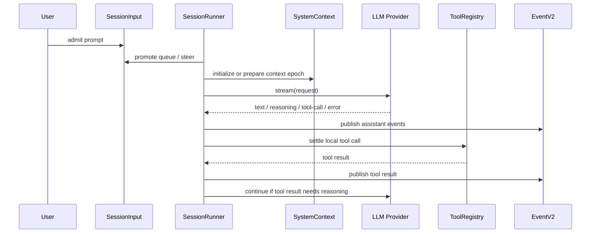

源码里最关键的函数是 `runTurnAttempt` 和 `run`。

`runTurnAttempt` 负责一次 provider turn：

- 读取 session。
- 选择当前 agent。
- 初始化或准备 system context epoch。
- 提升待处理用户输入。
- 解析模型。
- 读取 session history。
- 判断是否到达 agent step 上限。
- materialize 当前可用工具。
- 组装 `LLM.request`。
- 调用 `llm.stream(request)`。
- 流式发布文本、reasoning、tool-call、provider error。
- 对本地工具调用做 settlement。
- 等工具执行结束后发布 tool result。
- 判断是否需要继续下一轮。

`run` 则负责外层循环：

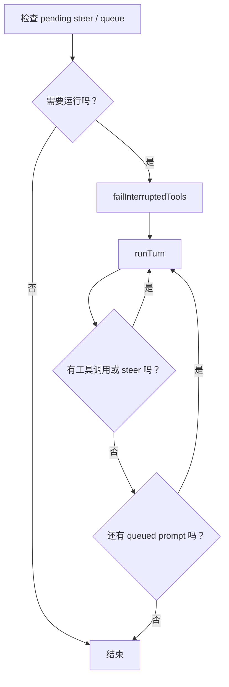

这说明 opencode 的一次“回答”并不一定只调用一次模型。只要模型调用了工具，工具结果回来之后 runtime 就会继续发下一次模型请求，直到模型最终回答、出错、中断，或达到 step 限制。

## 五、SessionInput：用户输入不是立刻进模型

在简单聊天里，用户发一句话，就直接追加到 messages。coding agent 不能这么粗糙。

opencode 把用户输入分成两个阶段：

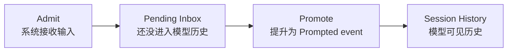

对应源码在 [`packages/core/src/session/input.ts`](https://github.com/sst/opencode/blob/dev/packages/core/src/session/input.ts)。

这里有两个 delivery 类型特别重要：

| 类型 | 含义 |
|---|---|
| `queue` | 排队等当前工作结束后作为下一轮任务进入 |
| `steer` | 当前运行中用户追加的转向指令 |

为什么要这样设计？

因为 coding agent 可能正在跑一个多轮任务：它刚读完文件，准备 edit；用户这时又输入“等等，别改这个文件”。如果 runtime 只是把消息粗暴追加到历史，模型是否看见、什么时候看见、会不会和正在执行的工具冲突，都很难控制。

`SessionInput` 的 admit/promote 机制让 runtime 可以明确回答：

- 这条输入已经被系统接收了吗？
- 它是否已经进入模型可见历史？
- 它是排队任务，还是当前任务的 steering？
- 它提升时对应的 event sequence 是多少？

这就是做真实 Agent 产品时会遇到的状态管理问题。

## 六、SystemContext：上下文不是字符串拼接

Agent 的质量很大程度取决于上下文工程。很多 demo 是这样做的：

```text
systemPrompt = basePrompt + projectPrompt + toolsPrompt + datePrompt
```

opencode 更工程化。它把 system context 抽象成多个可独立加载、比较和渲染的 source。源码在 [`packages/core/src/system-context/index.ts`](https://github.com/sst/opencode/blob/dev/packages/core/src/system-context/index.ts)。

一个 `Source<A>` 大致包含这些能力：

| 字段 | 作用 |
|---|---|
| `key` | 稳定、命名空间化的上下文 ID |
| `codec` | 把上下文值编码成可持久化 JSON，并支持比较 |
| `load` | 加载当前值 |
| `baseline` | 初次进入模型时如何渲染 |
| `update` | 值变化时如何渲染更新 |
| `removed` | source 被移除时如何告诉模型 |

整体流程是：

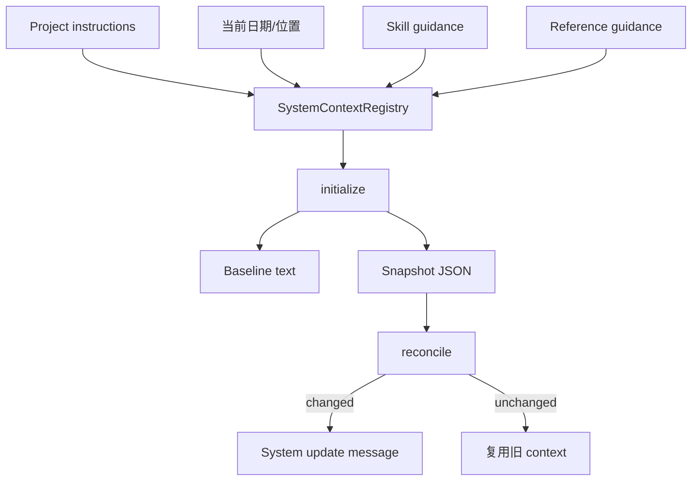

这个设计解决了几个实际问题：

- 上下文 source 可以独立刷新。
- 每个 source 有稳定 key，方便比较和持久化。
- 如果上下文变化，不必重写整个历史，可以生成 mid-conversation system update。
- 如果 source 暂时不可用，runtime 可以阻塞初始化或保留旧 snapshot，而不是悄悄丢上下文。

这正是 Agent 工程区别于 prompt demo 的地方：**上下文需要生命周期管理**。

## 七、Context Epoch：一段稳定上下文的生命周期

opencode 还有 `SessionContextEpoch`，源码在 [`packages/core/src/session/context-epoch.ts`](https://github.com/sst/opencode/blob/dev/packages/core/src/session/context-epoch.ts)。

可以把 epoch 理解成“一段上下文稳定期”：

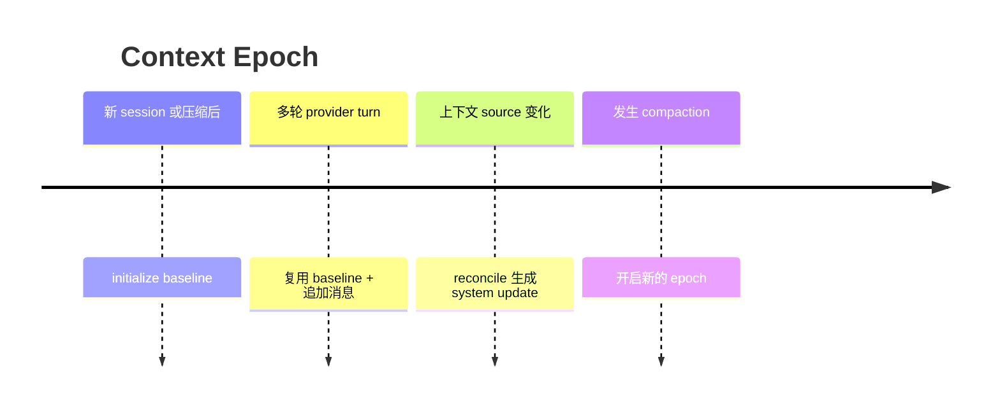

为什么要有 epoch？

因为模型请求不是孤立发生的。一次长任务里可能有十几次 provider turn。如果每次都重新拼接一份不同的 system prompt，调试、缓存、重放都会变差。epoch 让 runtime 记录“这一段会话基于哪一代 system context 运行”。

对找工作来说，这里有个很好的面试表达：

> 我不会把 context 当成临时字符串，而会把它看成有版本、有 snapshot、有 diff、有生命周期的运行时资源。

这句话背后就是 opencode 的 SystemContext + ContextEpoch。

## 八、LLM Request：把 session history 投影成模型消息

模型 provider 不直接理解 opencode 的内部 message。runtime 需要把 session history 转换成统一的 LLM message。

`SessionRunner` 里可以看到这条链路：

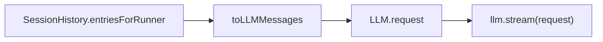

这里有两个细节值得注意。

第一，工具是否暴露给模型取决于 step。到了 agent 配置的最大 step，`toolChoice` 会变成 `none`，并追加 `MAX_STEPS_PROMPT`，让模型收尾。

第二，工具定义不是固定数组，而是通过 `tools.materialize(agent.info?.permissions)` 生成。这意味着当前 agent 的权限会影响模型能看见哪些工具。

换句话说，模型不是“天然知道所有工具”。runtime 会根据 agent、权限、step、上下文状态，决定这一轮请求里工具列表是什么。

## 九、ToolRegistry：工具调用的协议边界

工具系统是 coding agent 的手脚。opencode 的工具注册和执行在 [`packages/core/src/tool/registry.ts`](https://github.com/sst/opencode/blob/dev/packages/core/src/tool/registry.ts)。

简化之后是这张图：

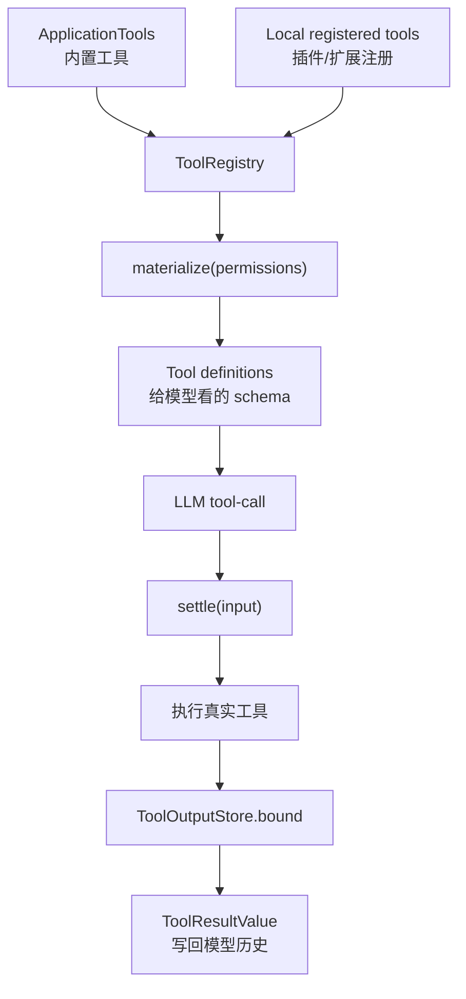

`materialize` 做两件事：

- 合并内置工具和本地注册工具。
- 根据 permissions 过滤掉完全禁用的工具。

`settle` 做的事更多：

- 根据 tool-call name 找到工具注册项。
- 判断是否是 stale tool call。
- 调用工具的 settle 函数。
- 捕获工具失败，转换成模型可见错误。
- 通过 `ToolOutputStore.bound` 限制输出大小。
- 把输出转换成 `ToolResultValue`。

这里有一个很重要的边界：**模型只产生 tool call，runtime 才执行工具**。

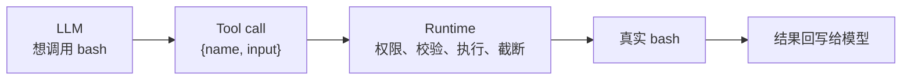

这个边界一旦模糊，Agent 就会变得危险。比如模型想跑一个危险命令，runtime 必须能拦住；模型传了错误参数，runtime 必须能给出可恢复错误；工具输出太长，runtime 必须能截断并保留路径。

## 十、PermissionV2：allow / ask / deny

真实 coding agent 一定要有权限系统。opencode 的权限逻辑在 [`packages/core/src/permission.ts`](https://github.com/sst/opencode/blob/dev/packages/core/src/permission.ts)。

核心结果有三种：

| 结果 | 含义 |
|---|---|
| `allow` | 自动执行 |
| `ask` | 发布 permission asked 事件，等待用户批准 |
| `deny` | 直接拒绝 |

简化流程如下：

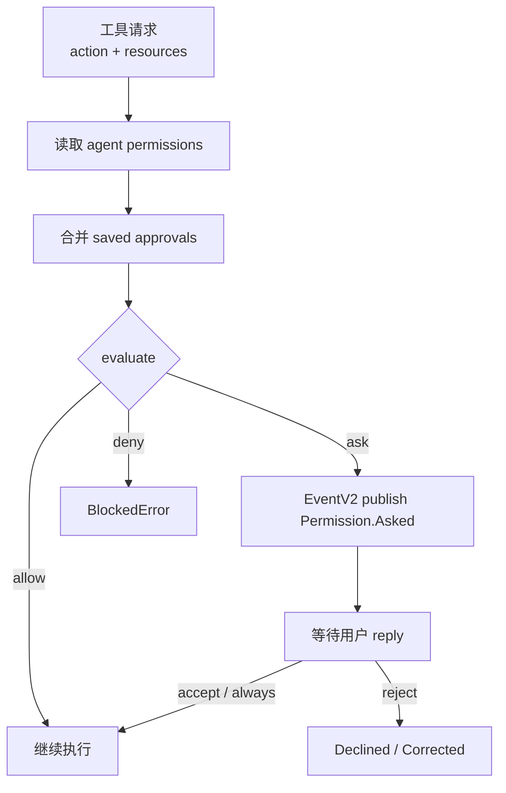

这里值得注意两点。

第一，默认不是所有行为都一刀切。不同 agent 可以有不同权限。比如规划型 agent 可以默认不允许编辑，构建型 agent 可以允许更多工具。

第二，`always` 这类用户批准会写入 saved permissions，后续相同项目里可以复用。这就是产品体验和安全性的折中。

对企业 Agent 开发来说，权限系统经常是面试重点。因为公司更关心：

- Agent 会不会读到 `.env`？
- 会不会把私有代码或日志发给外部服务？
- 会不会执行危险 shell 命令？
- 用户批准是否可审计？
- 拒绝之后工具状态如何回写给模型？

opencode 的 `PermissionV2.assert` 就是在这个边界上工作。

## 十一、EventV2：让客户端看到运行时状态

Agent 不是同步函数调用。它会流式输出文本、推理片段、工具调用、工具结果、权限请求、错误、文件变化。

所以 runtime 需要事件系统。

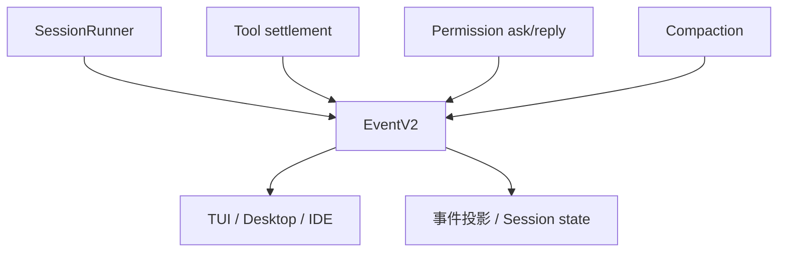

在 `SessionRunner` 里，`createLLMEventPublisher` 会把 provider stream 里的事件转换成 session event。这样 UI 不需要等整轮模型结束，能实时看到：

- assistant 文本增量；
- reasoning；
- tool-call 开始；
- tool-result；
- provider error；
- step ended；
- 文件 snapshot diff。

这也是为什么 Agent 产品的体验不像普通 HTTP 请求。它更像一个持续运行的任务流。

## 十二、Snapshot：工具执行前后到底改了什么

`SessionRunner` 在 provider turn 前后会调用 `snapshots.capture()`。如果 step settlement 成功，它会比较 start snapshot 和 end snapshot，发布 `SessionEvent.Step.Ended`，里面包含 files diff。

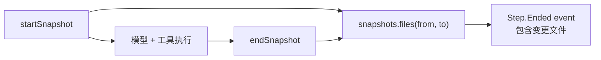

这对 coding agent 很重要。用户不仅想知道“模型说它改了什么”，还想知道“文件系统实际上变了什么”。snapshot 让 runtime 有机会把真实副作用纳入事件流。

## 十三、Compaction：上下文窗口不够了怎么办

长任务会把上下文窗口撑爆。opencode 的压缩逻辑在 [`packages/core/src/session/compaction.ts`](https://github.com/sst/opencode/blob/dev/packages/core/src/session/compaction.ts)。

它的核心思路是：保留近期上下文，把较早历史总结成结构化摘要。

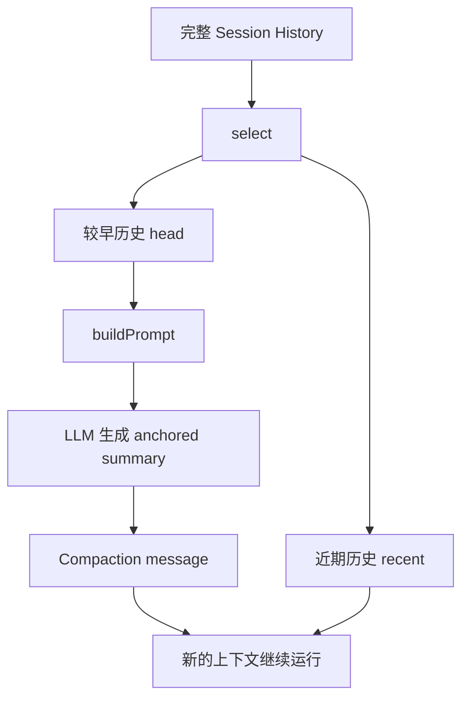

源码里的 summary template 很像一份接力笔记，固定包含：

- Objective
- Important Details
- Work State
- Next Move

这比随便让模型“总结一下”更可靠。因为 Agent 的压缩不是写读书笔记，而是为了让下一个 provider turn 能继续工作。

这里有三个工程点：

第一，工具输出会被截断。源码里 `TOOL_OUTPUT_MAX_CHARS` 控制 compaction 序列化时的工具输出长度。

第二，压缩会考虑模型 context limit 和 output limit。如果压缩 prompt 自己都塞不进去，就不会盲目压。

第三，有两条触发路径：正常估算发现快超了会 `compactIfNeeded`；provider 返回 context overflow 时会 `compactAfterOverflow`。

这类设计在求职时很有含金量。因为上下文窗口管理是 Agent 从 demo 走向生产的必经问题。

## 十四、一次完整运行，把模块串起来

把前面的模块合起来，一次 opencode session 大致是这样：

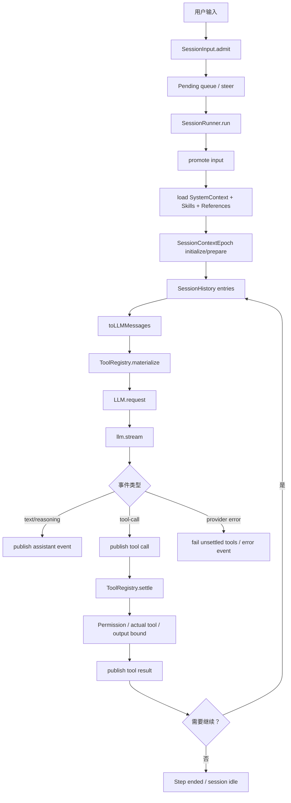

这张图就是 coding agent runtime 的主干。看懂它，再去看其他 Agent 框架也会快很多。

## 十五、opencode 设计里最值得学习的取舍

### 1. Core 和 UI 分离

opencode 不是把 Agent 逻辑写死在 TUI 里。核心运行时在 `packages/core`，客户端通过 server/API/事件使用它。这让桌面、IDE、TUI、SDK 可以共享核心能力。

### 2. 工具是协议，不是函数调用

工具不仅是一个函数。它有 name、description、schema、permission action、settlement、输出限制、错误协议、模型可见结果。

### 3. 上下文是可管理资源

SystemContext 有 source、snapshot、baseline、update、removed。Context Epoch 管一段稳定上下文。Compaction 管窗口压力。

### 4. 用户输入有生命周期

Admitted 不等于 Prompted。queue 和 steer 分开。这样 agent 可以处理用户中途改方向的情况。

### 5. Runtime 要承认失败

provider error、context overflow、用户拒绝、工具中断、stale tool call、unknown tool、max steps，这些都不是边角料，而是 agent 产品的日常。

## 十六、想找 Agent 开发工作，应该怎么学？

如果你把 opencode 当作学习项目，我建议按这个路线读源码。

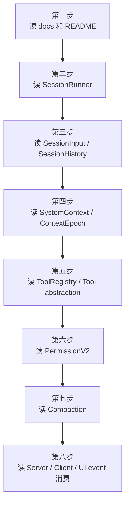

对应能力地图：

| 能力 | 为什么重要 | 在 opencode 里看哪里 |
|---|---|---|
| Agent loop | 所有 agent 的基本骨架 | `session/runner/llm.ts` |
| 状态机和持久化 | 支持恢复、中断、并发输入 | `session/input.ts`、`session/store.ts` |
| 上下文工程 | 决定模型表现上限 | `system-context/`、`session/context-epoch.ts` |
| 工具协议 | 决定 agent 能做什么 | `tool/registry.ts`、`tool/tool.ts` |
| 权限系统 | 决定产品能不能上线 | `permission.ts` |
| 流式事件 | 决定用户体验和可观测性 | `event/`、`session/event.ts` |
| 上下文压缩 | 决定长任务能不能跑 | `session/compaction.ts` |
| 多模型适配 | 决定系统扩展性 | `packages/llm/`、`provider.ts` |

## 十七、面试时怎么讲 opencode？

如果面试官问“你怎么理解 coding agent 的实现”，可以这样答：

> 我会把 coding agent 拆成一个 runtime，而不是一次模型调用。用户输入先进入 session input inbox，runtime 决定何时 promote 到模型历史。每一轮 provider turn 会加载 system context、选择 agent 和 model、投影 session history、materialize 当前允许的工具，然后流式调用模型。模型如果返回 tool call，runtime 会先记录事件，再做权限检查和工具 settlement，把工具结果 bounded 后写回历史。如果需要继续，就进入下一轮 provider turn。长上下文通过 compaction 压缩，客户端通过事件流观察整个过程。

这个回答覆盖了 Agent 开发岗位最关心的几个点：loop、session、context、tool、permission、streaming、compaction。

如果继续追问“你觉得最难的部分是什么”，可以说：

- 不是工具调用本身，而是工具调用前后的状态一致性。
- 不是 prompt 怎么写，而是上下文如何版本化、压缩、更新。
- 不是模型能不能改代码，而是权限、安全、审计和可恢复执行。
- 不是支持一个 UI，而是 core runtime 如何服务多个客户端。

## 十八、总结

opencode 的实现可以用一句话概括：

**它把 LLM 放进一个可持久化、可扩展、可审计、可控权限的编程运行时里。**

LLM 是大脑，但不是全部。真正让 Agent 能在真实代码库里工作的，是 runtime：

- Session 让任务有状态；
- SystemContext 让上下文可管理；
- ToolRegistry 让模型能安全行动；
- Permission 让副作用可控；
- Event 让 UI 能实时观察；
- Compaction 让长任务能继续；
- Provider abstraction 让模型可替换；
- Plugin/MCP/Skill 让能力可扩展。

如果你想进入 Agent 开发领域，不要只学“怎么写提示词”。更应该练习的是：如何设计一个可靠的 Agent runtime。

opencode 是一个很好的学习样本，因为它把这些问题都摆在了源码里。把它读透，再自己实现一个最小版 runtime，你对 Agent 的理解会从“会用工具调用”升级到“能设计 Agent 系统”。
