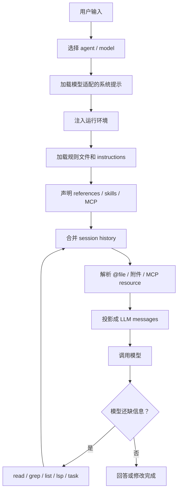
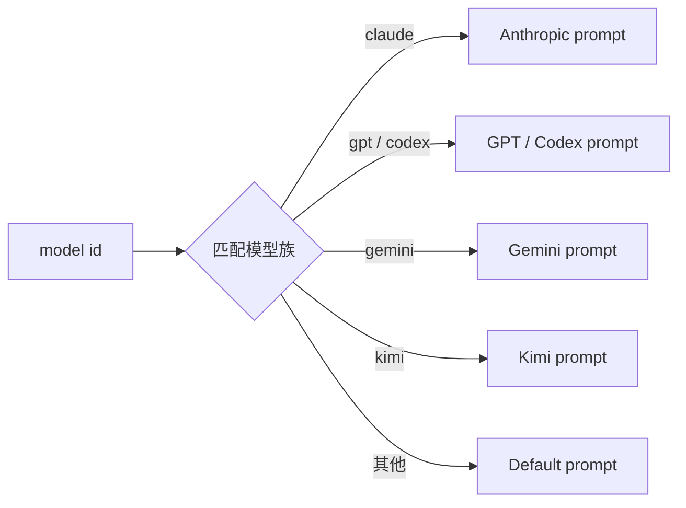
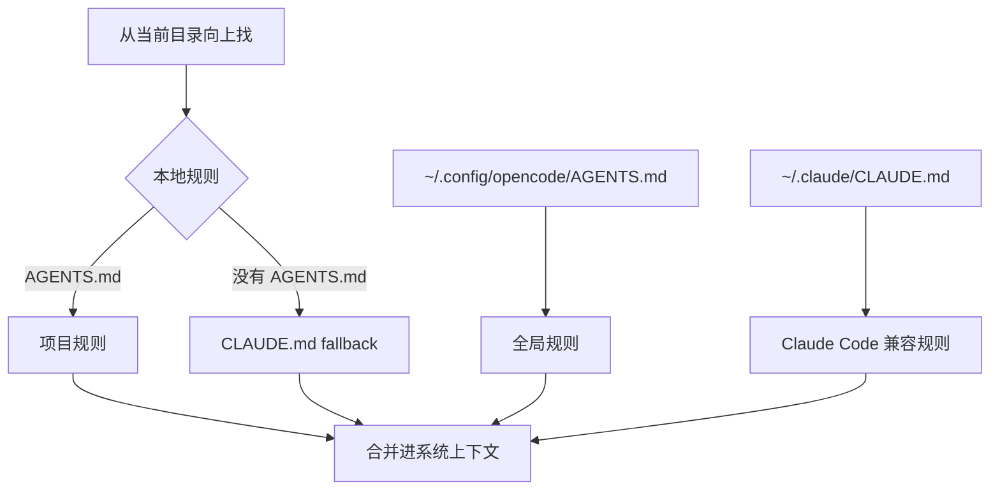
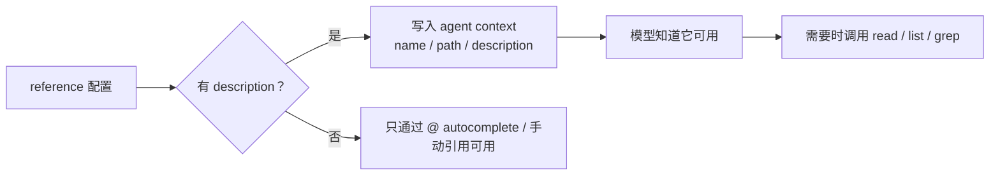
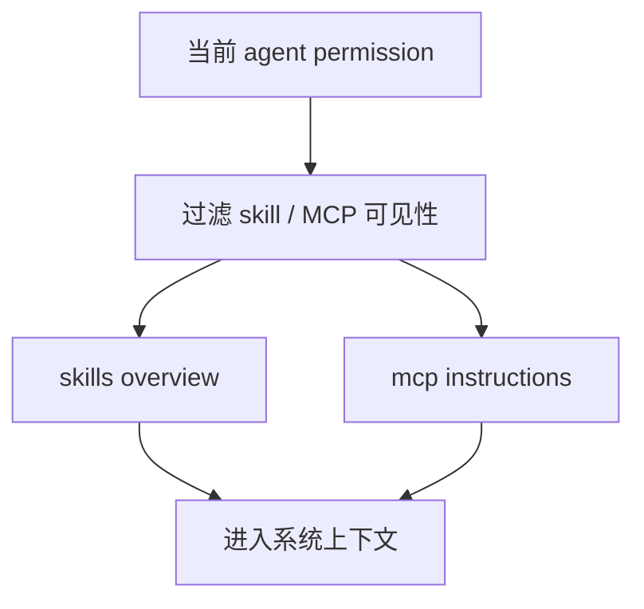
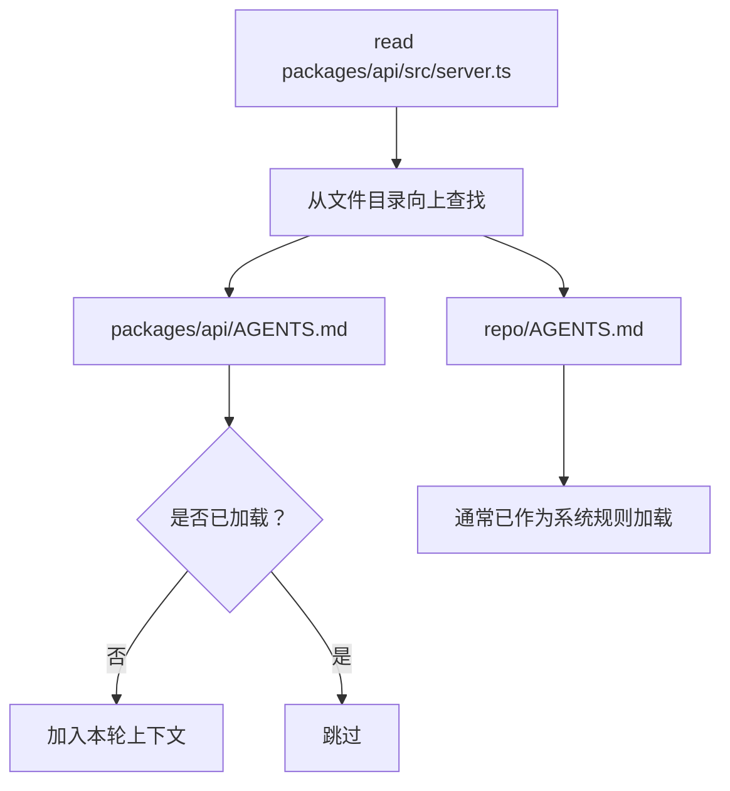
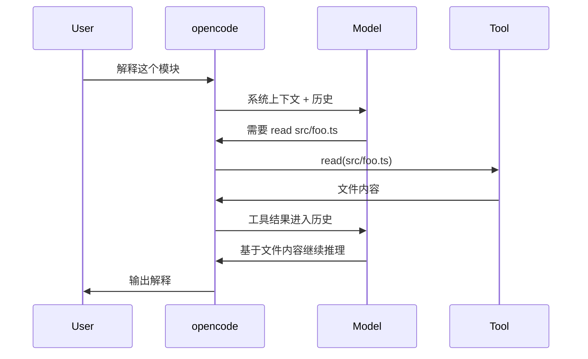
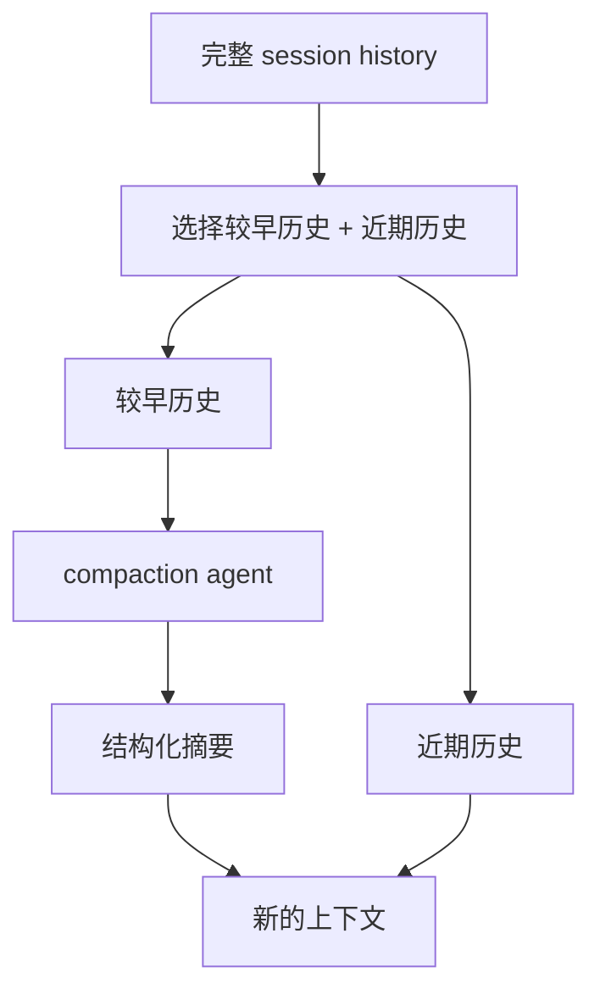
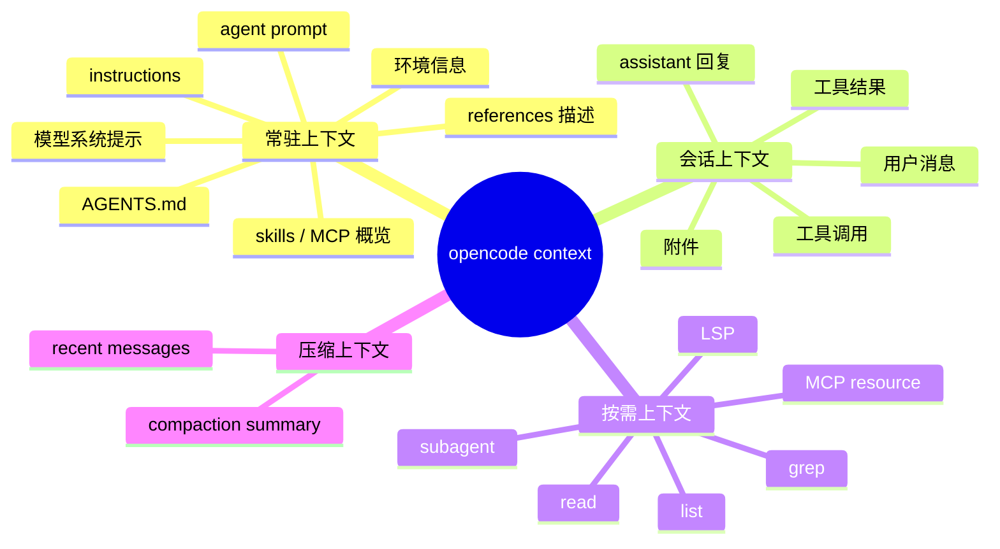
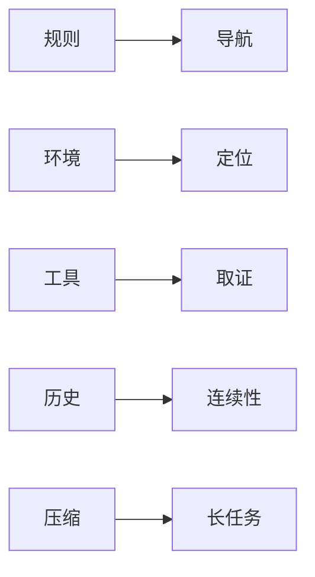

上一篇讲了 opencode 的整体架构：它不是一个“会聊天的代码助手”，而是一个围绕 LLM 构建的编程运行时。LLM 负责推理，runtime 负责会话、工具、权限、事件、压缩和恢复。

这篇继续往下拆一个更具体的问题：**opencode 到底是怎么把上下文组装给模型的？**

这个问题比“prompt 怎么写”更重要。coding agent 的效果，不只取决于模型本身，还取决于 runtime 每一轮到底让模型看见了什么、没看见什么、能不能继续查、查到的结果怎么写回历史、上下文太长时怎么处理。

一句话先给结论：

**opencode 不是把整个仓库一次性塞进模型，而是用规则文件提供长期导航，用 system prompt 描述运行环境，用用户引用和工具调用按需取证，再用 compaction 维持长会话。**

下面按一次模型请求的路径拆。

## 一、先建立一个心智模型

很多人以为 coding agent 的上下文是这样来的：


真实情况不是这样。仓库通常太大，不能全量塞进去；而且很多文件和当前任务无关，塞进去只会增加噪声。

opencode 更接近这条流水线：



这张图里最重要的点是：**上下文是动态组装的，不是静态预加载的。**

opencode 会先给模型一套足够好的“导航图”：你是谁、在哪个目录、项目有什么规则、有哪些外部参考、能用哪些工具。至于具体文件内容，通常是模型在任务过程中通过工具按需读取。

## 二、第一层：当前 agent 决定上下文边界

opencode 里不是只有一个助手。不同 agent 有不同职责、提示词、模型和权限。

内置 agent 大致分两类：

| 类型 | 例子 | 作用 |
|---|---|---|
| primary agent | `build` / `plan` | 用户直接对话的主 agent |
| subagent | `general` / `explore` / `scout` | 被主 agent 调用，处理特定子任务 |
| hidden agent | `compaction` / `title` / `summary` | 系统自动使用，不直接暴露给用户 |

这一步会影响后面所有上下文组装：

- 当前 agent 用哪个 `prompt`；
- 当前 agent 用哪个模型；
- 当前 agent 能不能读文件；
- 当前 agent 能不能改文件；
- 当前 agent 能不能执行 shell；
- 当前 agent 能不能调用 task / skill / websearch。

也就是说，模型不是天然拥有全部工具和全部项目视野。**agent 配置先定义了它的工作边界。**

比如 `plan` agent 适合分析和规划，默认会限制写文件和运行命令；`build` agent 才适合进入真实修改流程。上下文组装时，工具列表和权限也会跟着 agent 变化。

## 三、第二层：模型族对应的基础系统提示

确定 agent 和 model 之后，opencode 会按模型族选择基础系统提示。

源码里能看到类似这样的分流逻辑：如果模型 ID 包含 `gpt`、`codex`、`gemini-`、`claude`、`kimi`，就使用不同 prompt 模板；否则退回默认 prompt。



这不是多余设计。不同模型对工具调用、系统指令、格式约束、推理输出的习惯不同。一个成熟 agent runtime 不应该假设所有模型都吃同一套 prompt。

所以，opencode 的第一层上下文不是项目内容，而是**模型适配层**。

## 四、第三层：运行环境块

接着，opencode 会把当前运行环境注入系统上下文。典型内容包括：

- 当前模型的完整 ID；
- working directory；
- workspace root；
- 当前目录是否是 git repo；
- 当前平台；
- 今天日期；
- 可用的 project references。

可以把它理解成给模型的一张“现场卡片”：

```text
<env>
  Working directory: ...
  Workspace root folder: ...
  Is directory a git repo: yes/no
  Platform: ...
  Today's date: ...
</env>
```

这类信息解决的是定位问题。没有它，模型很容易出现几类错误：

- 生成错误的相对路径；
- 不知道项目根目录在哪里；
- 不知道当前是否能依赖 git；
- 在涉及日期的问题上使用过期假设；
- 不知道外部 reference 的实际路径。

很多 agent demo 会忽略这层，但真实工具里它很关键。coding agent 不只是回答问题，它要在一个具体工作区里行动。

## 五、第四层：规则文件是长期上下文

opencode 最重要的长期上下文来自规则文件，尤其是 `AGENTS.md`。

`AGENTS.md` 类似项目里的“给 agent 的 README”。它通常包含：

- 项目结构；
- 构建、测试、lint 命令；
- 推荐验证顺序；
- 代码风格；
- 架构边界；
- 目录职责；
- 项目特有坑点；
- 旧规则文件的迁移说明。

opencode 会按优先级读取规则。简化后是这样：



这里有两个容易忽略的细节。

第一，`AGENTS.md` 优先于 `CLAUDE.md`。这让 opencode 可以兼容 Claude Code 生态，但仍保留自己的规则入口。

第二，项目级规则不是无限叠加。通常是从当前目录向上找，找到第一类匹配就使用，避免把父目录、子目录、兼容文件全部堆进去。

这是一种克制：**规则文件要提供导航，而不是把上下文窗口塞满。**

## 六、第五层：`instructions` 用来拆分规则

如果规则很多，全部塞进 `AGENTS.md` 会变成另一种问题：文件太长，重点不清晰，模型反而容易忽略关键约束。

opencode 支持在 `opencode.json` 里配置额外 instruction 文件：

```json
{
  "instructions": [
    "CONTRIBUTING.md",
    "docs/guidelines.md",
    ".cursor/rules/*.md"
  ]
}
```

这些文件会和 `AGENTS.md` 一起进入系统上下文。opencode 还会保留来源信息，类似：

```text
Instructions from: docs/guidelines.md
...
```

这比复制粘贴到一个大文件更可维护。推荐的拆法是：

| 文件 | 内容 |
|---|---|
| `AGENTS.md` | 最短项目导航和必须遵守的规则 |
| `docs/testing.md` | 测试策略、命令顺序、fixture 约定 |
| `docs/api-guidelines.md` | API 错误码、鉴权、兼容性要求 |
| `docs/frontend-guidelines.md` | 组件边界、样式系统、可访问性 |

这种结构的目标不是“让模型多看点”，而是**让模型在正确层级上看正确规则**。

## 七、第六层：references 是“可访问目录声明”

opencode 还有一个很实用的概念：`references`。

它允许你把当前项目之外的目录或 Git 仓库挂进来：

```jsonc
{
  "references": {
    "docs": {
      "path": "../product-docs",
      "description": "Use for product behavior and terminology"
    },
    "sdk": {
      "repository": "anomalyco/opencode-sdk-js",
      "branch": "main",
      "description": "Use for JavaScript SDK implementation details"
    }
  }
}
```

关键点是：**reference 不是自动全文加载。**

带 `description` 的 reference 会被放进 agent context，让模型知道：

- 有这样一个外部目录；
- 它的实际路径是什么；
- 什么情况下应该使用它。

但具体要读哪个文件，仍然要靠工具按需读取。



这比“预加载外部文档目录”更合理。外部 reference 往往更大，里面只有少数内容和当前任务相关。先声明，再按需读取，能降低噪声。

## 八、第七层：skills 和 MCP 也会进入上下文

opencode 的扩展能力不只来自内置工具。它还支持：

- skills；
- MCP servers；
- plugins；
- custom tools；
- LSP。

这些扩展会以两种形式影响上下文。

第一，系统上下文会告诉模型有哪些 skills 可用，以及什么时候应该加载。模型不是一开始就读取所有 skill 详细内容，而是先看到 skill 名称、描述和触发条件。任务匹配时，再通过 skill 工具加载完整说明。

第二，MCP server 可以提供 instructions。opencode 会根据当前 agent 权限过滤 MCP instructions：如果某个 MCP 的工具全部被禁用，对应说明就不应该误导模型。



这说明上下文组装和权限系统是绑定的。模型不应该看到一堆自己根本不能调用的能力，否则它会产生错误计划。

## 九、第八层：用户显式引用会被解析成消息内容

长期规则和环境信息只是底座。真正让模型进入任务现场的，通常是用户显式引用：

- `@file`
- `@directory`
- `@reference/path`
- 拖入文件
- 图片附件
- MCP resource

opencode 会把这些输入解析成 session message parts。

如果是文本文件，runtime 会调用 read 工具读取内容，并把读取结果作为 synthetic text 写入消息。你在历史里会看到类似“Called the Read tool with the following input...”这样的痕迹。

如果是目录，runtime 会读取目录结构。  
如果是 MCP resource，会调用对应 MCP client 读取资源。  
如果是二进制附件，会根据 MIME 类型和大小决定是否能作为附件传给模型。  

这给使用者一个很实际的经验：

> 如果你希望模型一定考虑某个文件，不要只说“看看配置”，直接 `@` 它。

比如：

```text
请结合 @src/session/prompt.ts 和 @src/session/instruction.ts 解释上下文组装流程。
```

显式引用比让模型自己猜文件稳定得多。

## 十、第九层：读取文件时按需补局部规则

monorepo 里常见这种结构：

```text
repo/
  AGENTS.md
  packages/
    api/
      AGENTS.md
      src/server.ts
    web/
      AGENTS.md
      src/App.tsx
```

根目录规则只能描述全局约定。`api` 和 `web` 往往还有自己的局部规则。

opencode 的做法是：当 agent 读取某个文件时，从该文件所在目录向上查找附近的 instruction 文件。如果找到还没加载过、且不是系统已加载规则，就把它作为补充上下文加入当前消息。



这个设计解决了一个真实问题：既不能一开始把所有 package 的规则都塞进去，也不能在处理子项目时完全不知道局部约定。

所以 opencode 的上下文不是只有“会话开始时加载一次”。它还会在工具读取路径时，根据路径触发局部规则发现。

## 十一、第十层：session history 才是模型真正看到的连续上下文

前面几层最终都会和 session history 合并，然后投影成模型消息。

session history 里不仅有用户和 assistant 的文本，还包括：

- 工具调用；
- 工具结果；
- synthetic read result；
- 文件附件；
- MCP resource 内容；
- 权限请求和相关状态；
- compaction 后的摘要消息。

一次工具调用回来之后，工具结果会进入后续模型上下文：



这就是为什么 agent 能逐步推进任务：模型不是一次性知道所有东西，而是通过工具一层层取证。

## 十二、第十一层：工具列表也是上下文的一部分

模型能调用哪些工具，并不是固定的。

每一轮请求前，opencode 会根据当前 agent 和 permission materialize 工具定义。被完全禁用的工具不应该暴露给模型；到达 step 上限时，也可能把 tool choice 关掉，让模型收尾。


这点很容易被忽略：**工具 schema 本身也是 prompt 的一部分。**

工具的 name、description、input schema 会影响模型的计划方式。一个工具描述太宽泛，模型会乱用；一个工具描述太保守，模型会不用。权限过滤则保证模型不会计划自己不能执行的动作。

所以，上下文工程不只是文字说明，还包括工具协议设计。

## 十三、第十二层：上下文太长时交给 compaction

长任务一定会遇到上下文窗口问题。

opencode 的处理方式不是简单丢弃最早消息，而是使用隐藏的 `compaction` agent，把较早历史压缩成结构化摘要，再保留近期上下文继续跑。



好的 compaction 不是普通总结。coding agent 的摘要要服务后续执行，所以重点不是“这段对话讲了什么”，而是：

- 当前目标是什么；
- 已经查到哪些关键事实；
- 修改到哪里；
- 哪些文件重要；
- 下一步应该做什么；
- 有哪些不能忘的限制。

这也是为什么重要结论不要只留在聊天里。长任务里，聊天历史可能被压缩；真正重要的项目知识应该落到文件：

- `AGENTS.md`
- spec
- README
- ADR
- tests
- issue / PR 描述

## 十四、把所有层合起来

如果从一次模型请求看，opencode 的上下文大致可以分成四类。



用更工程化的话说：

| 上下文类型 | 生命周期 | 典型来源 |
|---|---|---|
| 常驻上下文 | 会话或 epoch 级别 | system prompt、环境、规则、reference 描述 |
| 会话上下文 | 多轮对话持续增长 | user / assistant / tool result |
| 按需上下文 | 工具调用时临时加入 | read、grep、MCP、LSP |
| 压缩上下文 | 长会话后替代旧历史 | compaction agent |

这个分层解释了 opencode 为什么不用全仓库预加载：它把“知道有哪些东西”和“真的读取这些东西”拆开了。

## 十五、使用 opencode 时怎么喂上下文

理解这套机制之后，实践建议很简单。

### 1. 把 `AGENTS.md` 写成项目导航卡

不要把 `AGENTS.md` 写成百科全书。它应该短、硬、稳定。

适合放：

- 项目结构；
- 常用命令；
- 验证顺序；
- 不要踩的坑；
- 代码风格；
- 架构边界。

不适合放：

- 大段历史背景；
- 已过期设计讨论；
- 低频细节；
- 可以按需读取的长文档全文。

### 2. 规则多了就拆到 `instructions`

如果测试、前端、API、部署都有规则，拆文件比堆在一起好。

```json
{
  "instructions": [
    "docs/testing.md",
    "docs/api-guidelines.md",
    "docs/frontend-guidelines.md"
  ]
}
```

这样模型能看到规则来源，人也更容易维护。

### 3. reference 一定写清楚 description

差写法：

```json
{
  "references": {
    "docs": "../docs"
  }
}
```

好写法：

```json
{
  "references": {
    "docs": {
      "path": "../docs",
      "description": "Use for product requirements, terminology, and feature behavior"
    }
  }
}
```

description 决定模型是否知道这个 reference 应该什么时候被用。

### 4. 当前任务文件直接 `@`

不要让模型猜。

```text
请基于 @src/session/system.ts @src/session/instruction.ts @src/session/prompt.ts 写一份上下文组装说明。
```

这种输入比“你看看源码讲一下”更可控。

### 5. monorepo 给子目录写局部规则

大型仓库推荐：

```text
AGENTS.md
packages/api/AGENTS.md
packages/web/AGENTS.md
packages/worker/AGENTS.md
```

让根规则管全局，让局部规则管局部。

### 6. 长任务把关键结论落盘

如果某个决定会影响后续修改，不要只让它留在聊天历史里。写进 spec、ADR、README 或测试。

因为 compaction 会保留大意，但不能保证每个细节都完整。

## 十六、如果面试被问到 context engineering

可以这样讲 opencode：

> opencode 的上下文不是一次性字符串拼接，而是一条 runtime pipeline。每轮请求先根据 agent 和 model 选择系统提示，再注入环境、规则文件、instructions、references、skills 和 MCP instructions。用户显式引用会被解析成 message parts，工具调用结果会写回 session history。读取文件时还会按路径发现局部 instruction。长会话超过窗口后，通过 compaction agent 把早期历史压成结构化摘要，再保留近期上下文继续运行。

这个回答比“把项目文件放进 prompt”准确得多。它覆盖了：

- agent 边界；
- system context；
- rules；
- references；
- tool result；
- local instruction discovery；
- compaction。

如果继续追问“难点是什么”，可以回答：

- 难点不是读取文件，而是决定什么时候读、读多少、怎么去重；
- 难点不是写 prompt，而是让上下文有来源、有生命周期、有权限边界；
- 难点不是总结历史，而是压缩后还能继续正确执行任务；
- 难点不是让模型知道更多，而是让模型少看噪声、看见关键事实。

## 十七、总结

opencode 的上下文组装可以概括成四句话：

第一，**规则文件提供长期导航**。`AGENTS.md` 和 `instructions` 告诉模型项目怎么工作。

第二，**环境信息提供当前坐标**。工作目录、workspace root、git 状态、平台和日期让模型知道自己在哪里。

第三，**工具调用提供按需取证**。模型不需要一开始看完整仓库，而是在任务推进中通过 read、grep、list、LSP、MCP 等工具逐步获取事实。

第四，**compaction 维持长任务连续性**。当上下文窗口不够时，把旧历史压成结构化摘要，而不是直接丢弃。

所以，opencode 真正值得学的不是某个 prompt 模板，而是这套上下文流水线：



coding agent 的能力上限，不只由模型决定，也由 runtime 每一轮给模型看的上下文决定。

这就是 opencode 这类项目最值得拆的地方：它把“上下文工程”从 prompt 技巧，做成了可配置、可追踪、可压缩、受权限约束的运行时能力。

## 参考

- [OpenCode Agents](https://opencode.ai/docs/agents/)
- [OpenCode Rules](https://opencode.ai/docs/rules/)
- [OpenCode References](https://opencode.ai/docs/references/)
- [OpenCode `system.ts`](https://github.com/anomalyco/opencode/blob/dev/packages/opencode/src/session/system.ts)
- [OpenCode `instruction.ts`](https://github.com/anomalyco/opencode/blob/dev/packages/opencode/src/session/instruction.ts)
- [OpenCode `prompt.ts`](https://github.com/anomalyco/opencode/blob/dev/packages/opencode/src/session/prompt.ts)
