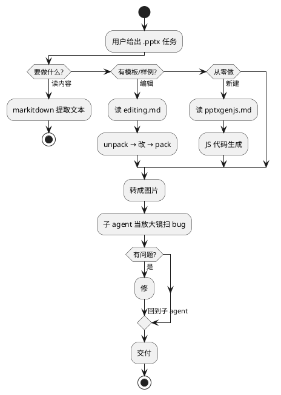
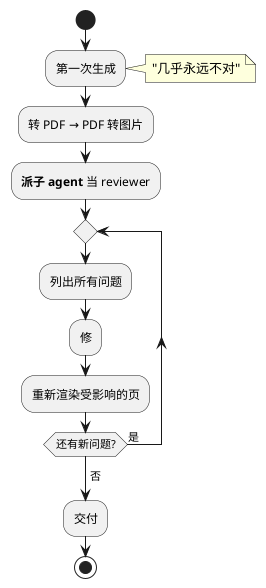
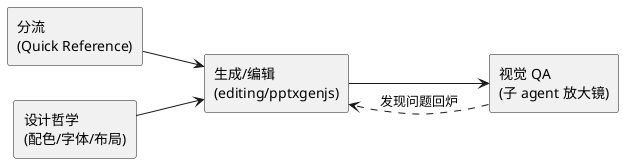

> 拆解 Anthropic 官方 pptx skill：为什么一个做 PPT 的 AI 技能要把"查 bug"写进流程里。

## 一句话定义

pptx skill 是一套让 AI 把"读、改、做 PPT"这件事做到不出戏的工作流，核心是 **三条路 + 一个放大镜**。

## 总览图



## 一个生活类比

想象你请设计师做 PPT：

| 场景         | 对应 skill 的路径    |
|------------|----------------|
| 你扔一份旧 PPT 给他：「照这个风格改」| editing 分支（模板驱动） |
| 你只有 idea：「从零帮我排」      | pptxgenjs 分支（代码驱动） |
| 你让他总结一下别人的 PPT：「里面讲了啥」| markitdown 分支（只读） |

skill 的第一步永远是**先分流**。这和人类设计师拿到需求先问"有没有参考"是一个道理。

## 核心拆解

### 1. Quick Reference 表先行

```
| Task                  | Guide              |
|----------------------|--------------------|
| Read/analyze content | markitdown         |
| Edit from template   | editing.md         |
| Create from scratch  | pptxgenjs.md       |
```

第一屏就是路由表。模型读完这张表，基本就知道接下来该跳到哪个子文档。**这是典型的 progressive disclosure**——SKILL.md 只管分流，细节押到 editing.md / pptxgenjs.md 里按需加载。

### 2. Design Ideas：反对"AI 味 PPT"

skill 里花了大段篇幅讲视觉设计，核心就一句：

> Don't create boring slides.

具体抓手包括：

- **10 种预设调色盘**（Midnight Executive、Coral Energy……），让模型不再无脑用蓝色
- **60-70% 主色 + 1-2 辅色 + 1 个点缀色** 的占比规则
- **深浅背景三明治结构**（封面深、内页浅、结语深）
- **字体组合表**（Georgia + Calibri、Impact + Arial……），杀掉 Arial 一统天下

最有意思的一条：

> **NEVER use accent lines under titles** — these are a hallmark of AI-generated slides

作者直接把「AI 做的 PPT 长什么样」当成反例。这条规则只有反复看过太多 AI 生成 PPT 的人才写得出来——是经验主义补丁，不是拍脑袋规则。

### 3. QA 是硬流程，不是可选项



注意三个反常识设计：

1. **强制假设有 bug**：skill 的原文是 "Assume there are problems. Your job is to find them."。这是对抗 LLM 自我满足倾向的反向 prompt。
2. **强制派子 agent 做视觉评审**：理由是"你盯着代码看太久了，会看到你以为的东西，而不是真的存在的东西"。fresh eyes 比自己 double-check 可靠。
3. **改完一处要重检查一次**：因为"修一个坑往往引出另一个坑"。

### 4. 重复文字会被 grep 抓包

```bash
python -m markitdown output.pptx | grep -iE "xxxx|lorem|ipsum|this.*(page|slide).*layout"
```

这条命令的存在说明一个事实：**模型真的会把 "XXXX Placeholder" 留在成品里**。不是偶尔，是经常。所以作者干脆内置一条正则兜底检查。

## 对比：三条路什么时候用

| 场景               | 选哪条                | 原因                  |
|------------------|--------------------|---------------------|
| 用户给了 .pptx 模板    | editing.md         | 保留设计语言，省力           |
| 用户只给主题没给模板       | pptxgenjs.md       | 可完全定制，但要自己做视觉       |
| 用户只想知道别人 PPT 讲啥   | markitdown         | 只读，快速提取            |
| 用户只发你一个链接就走了     | markitdown 先用，再追问   | 不要自作主张编辑            |

## 常见坑（skill 里踩过的）

- 标题换行后原本对齐的装饰线会错位——专门列在视觉 QA 清单里
- 文本框有内边距，你想让一条竖线贴着文字左缘就要 `margin: 0`
- 亮色图标放亮色底上会看不见——低对比度是视觉 QA 第一优先级
- 一页美化了，其它页没跟上——要么全做，要么全不做，别挑着做

## 一张图收尾



pptx skill 最值得抄的不是任何一段代码，而是**把"假设有 bug 并主动找 bug"写进工作流**——这是让 AI 产出真正能用的 PPT 的分水岭。
