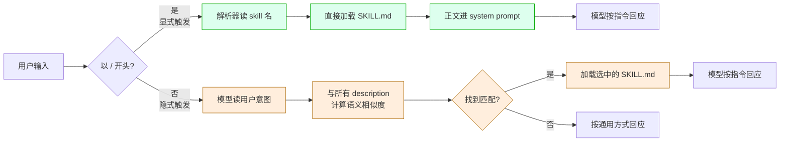
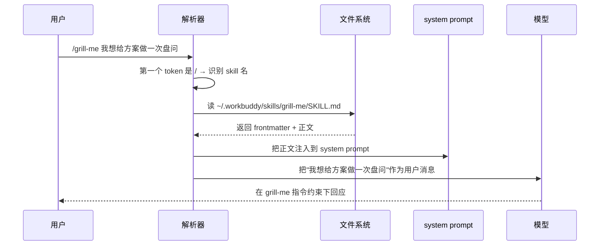
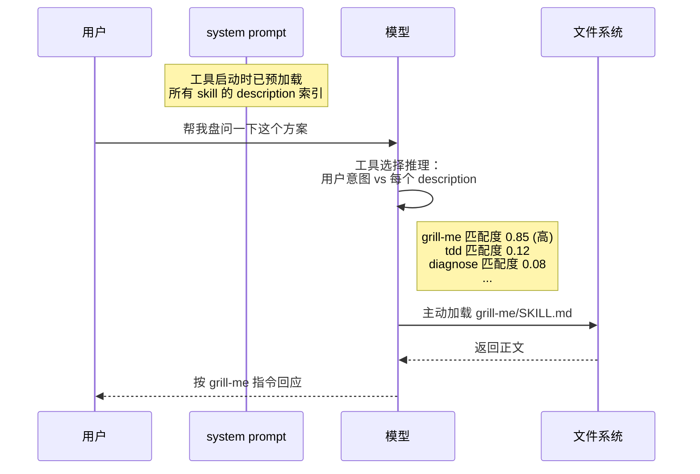
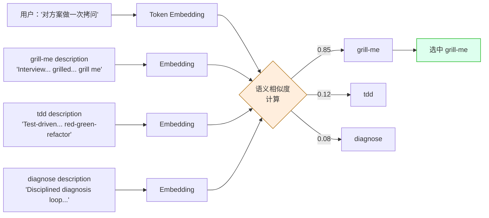
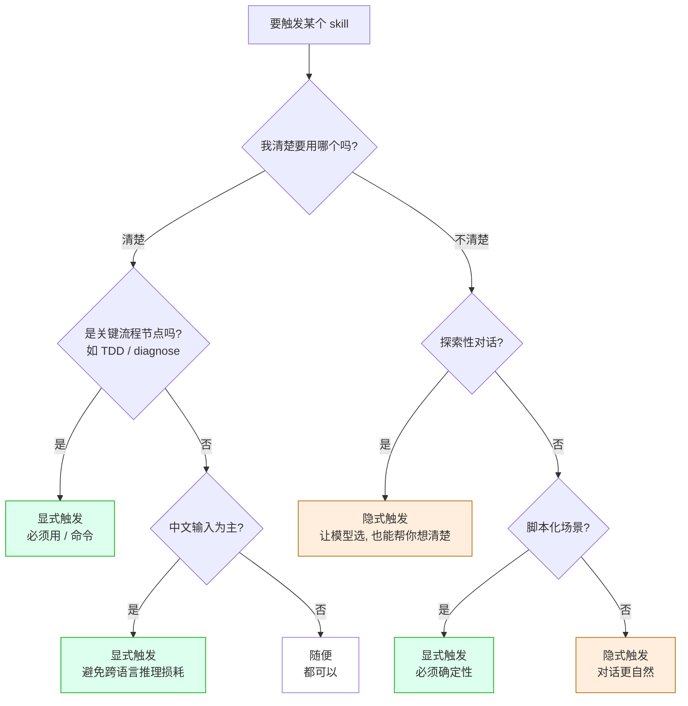

在用 Claude Code、Cursor 或 WorkBuddy 这类 AI 编码助手时，触发一个 skill（slash command）有两种方式：显式输入 `/skill-name`，或者用自然语言让 AI 自己识别意图。表面看是输入风格的差异，底层其实是两套完全不同的执行路径。这篇试图把这两条路径讲透。

## 一、先对齐：Skill 长什么样

在文件系统上一个 skill 长这样：

```
~/.workbuddy/skills/grill-me/
├── SKILL.md
└── references/         # 可选的延伸文档
```

`SKILL.md` 有两部分：

```yaml
---
name: grill-me
description: Interview the user relentlessly about a plan or design until
  reaching shared understanding, resolving each branch of the decision tree.
  Use when user wants to stress-test a plan, get grilled on their design,
  or mentions "grill me".
---

Interview me relentlessly about every aspect of this plan...
（正文指令）
```

`name` 是 ID，`description` 是给 LLM 看的"使用说明书"，正文是被触发后注入到对话里的指令模板。

工具启动时会扫描所有 skill 目录，**把每个 skill 的 name + description 拼成一份索引**，作为 system prompt 的一部分送给模型。这份索引是隐式触发能工作的前提。

下面这张图把两条触发路径并排画一下，先看个全貌：



绿色路径是显式，黄色路径是隐式。两条路径在第二步就分开了——一个走"指令式加载"，一个走"基于推理的选择"。

## 二、显式触发：指令式加载

输入 `/grill-me 我想给方案做一次盘问` 时，工具的内部执行是这样的：



关键特征：

- **加载是确定的**——你说加载哪个就加载哪个，没有任何决策环节
- **加载是直接的**——文件 → system prompt，不经过模型推理
- **加载是单一的**——一次只能 `/<one-skill>`，多 skill 要分多条消息

可以把它理解成 shell 里 `bash script.sh`：你明确告诉系统执行哪个脚本，参数是什么。系统不需要"理解"你想干什么。

## 三、隐式触发：基于语义的工具选择

输入 `帮我盘问一下这个方案` 时，路径就完全不一样了：



注意第二步——**模型在自己的"工具选择"环节逐个评估每个 skill 的 description 与用户意图的匹配度**。这是隐式触发能不能工作的关键。

## 四、LLM 是怎么做工具选择的

这是整篇文章的核心。隐式触发能不能工作、什么时候出错，全靠这一步。

### 4.1 它不是 grep

很多人误以为隐式触发是关键词匹配："用户说了 grill，所以匹配 grill-me"。这个心智模型是错的。

实际上，模型把整个 system prompt（含所有 skill 的 description）和用户消息一起，作为输入序列做一次前向计算。在这个计算里：

- 每个 skill 的 description 被映射成一组 token embedding
- 用户消息也被映射成一组 token embedding
- 模型通过 attention 机制让两组 embedding 互相影响
- 在输出层（或更早的 reasoning 层），模型生成"是否选择这个 skill"的决策

简单说：**它做的是语义相似度判断，而不是字符串匹配**。

可以画成这样：



### 4.2 一个具体例子

用户输入"帮我对这个方案做一次拷问"。

如果是 grep 匹配：
```
grep "拷问" 所有 description
→ grill-me description 里没有"拷问"两字
→ 不匹配
```

但实际上模型的判断是：

```
"拷问" 的 embedding ≈ "interrogate" / "grill" / "interview" 的 embedding
                    （在多语言模型中，跨语言的同义词通常在向量空间中相邻）
                    
grill-me description 中的 "interview relentlessly" 与
用户意图 "对方案做一次拷问" 的语义相似度高
                    
→ 选择 grill-me
```

**所以中文的"拷问"能触发英文 description 的 grill-me**——只要模型的多语言能力把这两个概念映射到了相邻的向量空间。

### 4.3 词性（动词/名词）会不会影响

不会显著影响，但有微妙差异。

```
"盘问我"（动词）        →  ≈ "interview me" / "grill me"
"做一次盘问"（动名词）  →  ≈ "do an interview" / "have a grilling session"
"我希望被盘问"（被动）  →  ≈ "I want to be interviewed"
```

这三种说法在向量空间里都很接近 grill-me 的 description，所以都能触发。**模型在意的是"动作和对象"是否对得上**，不在意你用的是动词还是名词形式。

实际上，名词形式有时反而更稳。看一下 grill-with-docs 的 description：

```yaml
description: Grilling session that challenges your plan against...
```

第一个词就是名词 "Grilling session"。所以"做一次方案盘问"（≈ a grilling session）匹配它的概率，可能比"盘问我"（≈ interview me）还要高一点。

### 4.4 description 的写法决定召回上限

description 写法决定隐式触发的天花板。看几个对比：

```yaml
# 写法 A（窄）
description: Run TDD.

# 写法 B（宽）
description: Test-driven development with red-green-refactor loop.
  Use when user wants to build features or fix bugs using TDD,
  mentions "red-green-refactor", wants integration tests, or asks
  for test-first development.
```

A 只能匹配显式的 "TDD" / "test-driven development" 字眼。B 把同义动作（write tests first / red-green-refactor）也囊括了，召回率高一截。

mattpocock/skills 的 description 普遍走 B 风格，每个都列 4-6 种触发场景。这是隐式触发能工作的前提。

## 五、两种触发方式的全维度对比

| 维度 | 显式触发 | 隐式触发 |
|---|---|---|
| 加载机制 | 解析器直接加载文件 | 模型推理决定加载 |
| 决策环节 | 无 | 有（在工具选择层）|
| 命中率 | 100% | 70-90%，看 description 写法 |
| 加载的 token 成本 | 一次：目标 skill 的正文 | 持续：所有 skill 的 description 驻留 system prompt |
| 推理开销 | 无 | 多一次工具选择推理 |
| 错误模式 | 几乎不出错（除非 skill 文件损坏） | 可能选错、选不到、选多个 |
| 对中文输入 | 无差异（命令是英文） | 跨语言推理有损耗 |
| 多 skill 协作 | 一条消息一个 skill | 模型可在中途切换 |

## 六、隐式触发的失败模式

理解了机制就能预测它什么时候会出错。常见三种：

### 6.1 同义词盲区

description 里没出现的概念，即使模型理解，也可能匹配不到。

```
你说："quiz 我一下这个方案"
grill-me description: "Interview the user relentlessly... mentions 'grill me'"

quiz vs interview/grill 的语义距离不算近：
  - interview/grill 强调"系统性、反复、深入"
  - quiz 强调"快速测试知识"
  
模型可能不触发，或触发但行为偏。
```

**改善方法**：在 description 里多加几个同义词。

### 6.2 意图模糊

用户输入的语义指向不明确，多个 skill 都半匹配，模型可能干脆都不选。

```
你说："帮我看看这段代码"

候选 skill：
  - diagnose: 诊断 bug
  - zoom-out: 拉高视角看代码
  - improve-codebase-architecture: 找架构改善

"看看" 太通用，三个都不强匹配。模型可能：
  (a) 都不选，按通用方式回复
  (b) 选语义最近的一个（比如 zoom-out）
  (c) 让你澄清想做什么
```

**改善方法**：用户在意图模糊时主动加修饰词："帮我**诊断**一下这段代码"、"帮我**找架构问题**"。

### 6.3 多 skill 关键词撞车

多个 skill 的 description 里有重叠概念，模型不知道选哪个。

```
你说："帮我重构一下这块"

候选：
  - improve-codebase-architecture: ... refactor opportunities ...
  - tdd: ... refactor 是 red-green-refactor 的最后一步 ...

"重构" 在两个 description 里都出现。
模型可能：
  (a) 选 improve-codebase-architecture（它更专业地讲重构）
  (b) 选 tdd（如果上文刚讨论过测试）
  (c) 在 attention 计算时被前文 bias
```

**改善方法**：要么用显式 `/skill-name`，要么在描述里加上下文锚点："**先写测试再**重构这块"。

## 七、什么时候用哪种？

把上面的机制理解转化成几条决策规则：



**四条核心规则**：

**规则 1：关键节点用显式**
TDD 写新功能、diagnose 修 bug、to-issues 拆 ticket —— 这些是工作流里"决策成本高"的环节，不能让模型猜错。显式 `/skill-name` 是 30 秒成本换 100% 命中率，划算。

**规则 2：探索性对话用隐式**
你不确定想用哪个 skill 时（比如刚开始研究一个新问题），让模型基于你的描述自己选。它选错了你也能从它的回应里看出"它把我的意图理解成了什么"，反而帮你想清楚。

**规则 3：description 写得好，隐式才靠谱**
自己写 skill 时，description 字段要列足同义词、同义动作、明确触发短语。这是给"未来的隐式触发"投资。

**规则 4：中文输入更要用显式**
绝大多数 skill 是英文 description。中文输入需要模型做跨语言语义匹配，多一步推理就多一份不确定性。中文为主的工作场景，默认显式更安全。

## 八、一个被忽略的设计含义

理解了显式 vs 隐式的差别，还能反过来指导**怎么设计 skill 集合**。

如果你的工具用户主要做**显式触发**（比如内部团队，每个人都知道命令名），那 skill 数量可以很多——每个都是独立工具，互不干扰。

如果你的工具用户主要做**隐式触发**（比如面向外部用户的产品），那 skill 数量必须克制——因为模型在做工具选择时，N 个 skill 之间会互相 bias，N 越大越混乱。Anthropic 的 Claude Code 在这方面就保守，原生 skill 数量很少；而 mattpocock 的方案是把 skill 拆细但每个 description 写满触发词，本质上是把"减少候选"的成本转嫁到"提高描述质量"上。

这两条路没有绝对优劣，看你的用户画像。

## 九、一句话总结

> **显式触发是"指令"，隐式触发是"暗示"。**
>
> **指令永远是确定的，暗示永远是概率的。**
>
> **当你需要确定性，就别用暗示。**

这条规则放在所有 LLM-driven 工具上都成立——不只是 skill 系统，也包括 RAG 召回、tool calling、agent routing。理解了概率本质，才能在合适的位置选合适的方案。
