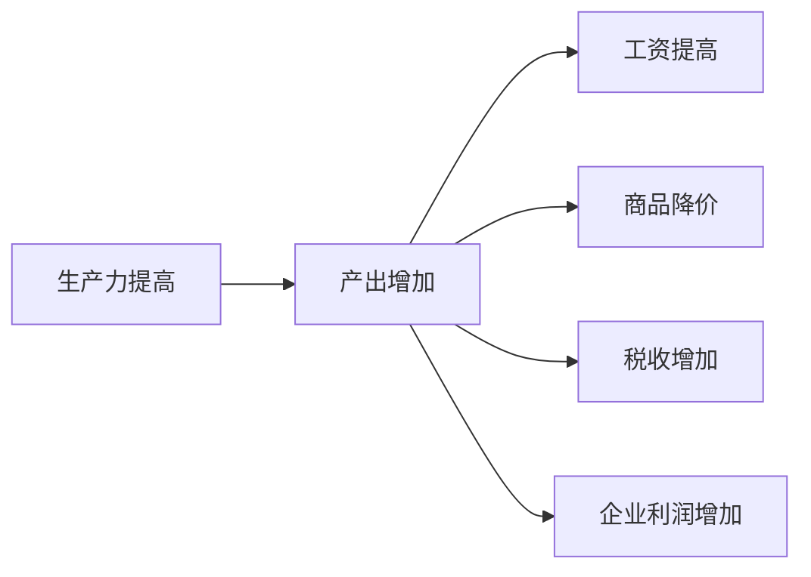
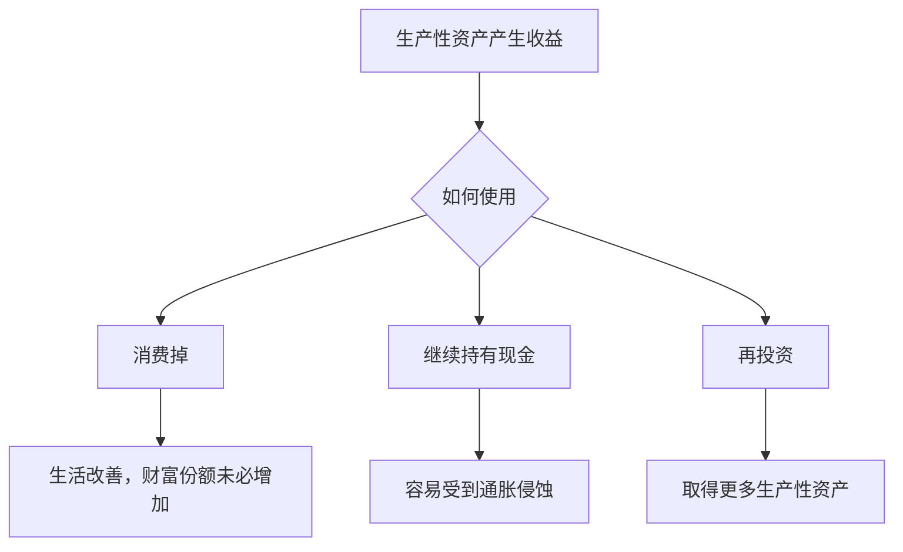

一个人积累到一定财富后，不再依靠工资增加本金，只做长期投资。随着生产力进步、新企业出现、制度不断变化，这笔财富会不会迟早缩水？

直觉上似乎会。今天值钱的工厂，明天可能被新技术淘汰；一笔多年不动的现金，也会被通胀慢慢侵蚀。

但这个问题不能只看账户里的数字。财富真正代表的，是一个人对未来产品、服务和稀缺资源的索取能力。

## 生产力创造财富，但不决定财富归谁

生产力提高，意味着同样的人力和资源可以生产更多东西。新技术可能让商品更便宜，让工资提高，也可能转化为企业利润。

新增产出流向哪里，取决于竞争、产权、税收和劳资关系。

如果技术红利主要转化为工资，劳动者受益更多；如果竞争激烈，红利可能表现为商品降价，消费者受益；如果企业拥有品牌、专利或网络优势，一部分红利会成为利润，最后流向股东。

所以，生产力负责把蛋糕做大，分配制度决定蛋糕落到谁手里。

## 为什么股权可能跟上生产力

现金只是一张固定面额的索取凭证。企业股权则不同，它代表对一套生产系统的所有权。

企业不断更换设备、采用新技术、招聘人才，也会收购有前景的新公司。持有大型企业指数，相当于持有一组会更新的生产性资产，而不是守着某一家永远不变的工厂。

这也是股权可能抵御技术淘汰的原因。旧企业会衰落，但指数可以将它移出，再纳入成长起来的新企业。

不过，生产力带来的好处并不会全部归股东。企业需要支付工资、原料、利息和税收，剩下的才属于股东。股东获得的是剩余，也承担亏损、破产和估值下跌的风险。

高回报并不是凭空产生的礼物。

## 回报率不等于社会财富增长率

假设一个果园价值一百万元，每年结出十万元的果实。果园本身没有变大，但它产生了收益。

社会财富存量可能增长缓慢，生产性资产仍然可以持续产生现金流。股票总回报还包含分红和回购，因此可能高于社会财富存量的增长速度。

真正影响个人财富占比的，是拿到收益后如何处理。

有人领取股息后用于生活，有人退休后出售股票，也有人把遗产分给许多继承人。持续再投资的人，则会从这些出售者手里取得更多所有权。

因此，一个规模很小的投资者可以在相当长的时间里提高自己的财富占比。原因未必是整个股市无限膨胀，而是他消费得比别人少，并持续购买别人让出的资产。

## 为什么这种优势不能无限延续

如果股票能够确定地跑赢所有资产，资金就会不断涌入，股价随之上涨。企业还是那家企业，但买入价格越来越高，未来回报自然下降。

如果全社会都不消费，把所有收益都用于扩大生产，问题也会出现：新工厂生产出来的商品最终卖给谁？需求不足时，资本会闲置，利润率也会下降。

税收、竞争和技术替代同样会重新分配收益。新生产力还可能出现在私营企业、其他国家或新的组织形式中，未必及时进入现有的大型企业指数。

所以，大型企业股权可以在几十年里跑赢社会财富，却无法依靠固定的优势无限复利。时间拉得越长，原来的优势越容易被价格和制度吸收。

## 长期投资真正依靠什么

长期持有标普的价值，不在于迷信这个指数，而在于它让普通人以较低成本，持有一批不断更新、能够持续创造利润的企业。

这里也不是建议频繁更换指数。跨度足够长时，投资者仍要面对国家、税制、市场结构和所有权形式的变化。

财富不会因为新技术出现就自动消失。真正容易缩水的，是不能产生收益、不能调整形态，又无法分享新增生产力的财富。

对个人来说，比较稳妥的思路不是寻找永不贬值的东西，而是尽量持有能够参与生产、分散风险并适应变化的所有权。即便如此，也只能提高长期存续的概率，无法取消风险本身。
