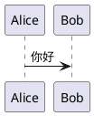

# 博客发文约定（wendellzone.github.io）

## Frontmatter

固定四个字段，顺序随意，但不要加额外 key（前端只读这四个）：

```yaml
---
title: 在 Markdown 里直接写 PlantUML
date: 2026-05-09
tags: [工具, 前端]
summary: 用 marked 自定义 renderer + plantuml.com 的 /svg/ 服务
---
```

- **title**：显示标题。可以含中文、英文、标点，但不要以空格或引号开头。
- **date**：ISO `YYYY-MM-DD`，列表按此字段倒序排。新文用今天。
- **tags**：短数组，主题标签。推荐池：`后端` / `前端` / `工具` / `隐私计算` / `长安链` / `Go` / `JavaScript` / `Python` / `复盘` / `杂记`。有新主题就加，不要因为追求整齐把"Go 后端"拆成两条相近的标签。
- **summary**：一句摘要。≤ 50 个汉字 / 80 个英文字符。纯文本，不要 markdown。

## slug（URL 后缀）

- 英文/拼音标题：自动生成的 kebab-case 够用，可以手动覆盖 `--slug`。
- 纯中文标题：脚本会兜底为 `post-<YYYYMMDDHHMM>`。强烈建议在发文时显式指定一个英文 slug，例如：
  ```
  publish.py new --title "冷启动优化笔记" --slug cold-start-notes
  ```
- slug 最长 60 字符，只能 `[a-z0-9\-]`。
- 已用过的 slug 不能重用；重名会报错让你换。

## 文件位置

- 正文源：`posts/<slug>.md`
- 索引：`posts/index.json`（列表页从这里读，不扫目录）
- 所有路径相对仓库根。

## Markdown 语法

### 通用 GFM

标题（正文里**不必**再写 H1，页面头已经渲染了 `title`；想要就用 `##` 起）、列表、表格、引用、删除线、任务列表、链接、图片。

### 代码高亮

```
```go
fmt.Println("hi")
```
```

支持 highlight.js common 包里的语言（go / js / ts / py / rs / sh / bash / json / yaml / sql / diff / ...）。lang 标签大小写不敏感。

### PlantUML

用 ` ```plantuml ` 或 ` ```puml ` 围栏：

```

```

前端会异步拉 `plantuml.com/plantuml/svg/<encoded>` 回显 SVG，带 8 秒超时和失败降级提示。渲染不受构建影响，访客浏览器直连 plantuml.com。

### 跨文章链接

hash 路由，不要用 `./other.md`：

```markdown
[看这篇](#/post/mira-secure-data-flow)
```

### 图片

外链（比如 GitHub raw 或图床）最稳。要放本地图就放 `posts/assets/<slug>/xxx.png`，正文引用 ``。

## 风格要点

- 标题用陈述式，别做标题党（"一次拆解 xxx"、"从 0 到 1 做 xxx" 这类具体的比"震惊！！"强）。
- 首段直接进主题，不要"本文分几个部分…" 这种套话。
- 代码片段超过 20 行考虑抽到小节或用省略号。
- 结尾可以有"下一篇见"/"改天再拆 xxx"一句，但不要刻意立 flag。

## 避免

- 不要在正文里写"点击此处订阅"、"欢迎关注"之类营销文案。
- 不要 AI 味：排比结尾、"值得一提的是…"、"综上所述"、空洞的总结段落。
- 不要引用未核实的工业界数据，宁可说"我当时的印象是…"。
- 不要在公开文章里写仍在就业的公司内部非公开信息。
